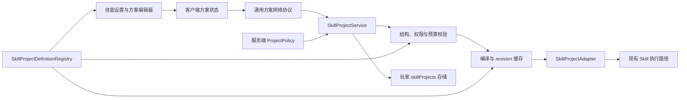

# 全能力可配置技能方案系统计划

> 文档状态：提案（Proposed）
>
> 文档版本：0.1
>
> 更新日期：2026-08-08
>
> 目标项目：AcademyCraft Reborn 26.2
>
> 目标范围：当前注册的 91 个技能

## 1. 执行摘要
n
本计划拟为全部技能增加玩家可保存、切换并由服务端校验的“技能方案（Skill Project）”。系统借鉴“精密操作”的四槽位、节点编辑、版本冲突检查、服务端编译与执行模型，但不直接复制其心理掌握专用实现。

最终方案分为三层：

1. **参数方案**：所有主动技能至少支持一种。用于配置强度档位、范围、持续时间、方向、模式、目标偏好及视觉反馈等有限参数。
2. **策略方案**：持续、切换、防御与被动技能使用。用于配置启停阈值、优先级、目标过滤及安全策略。
3. **节点方案**：仅对存在组合价值的技能开放。使用可扩展的强类型节点图表达目标选择、数据处理和动作顺序。

不配置方案时，技能必须保持当前行为。玩家不能通过方案直接设置原始伤害、CP 消耗、冷却时间或绕过技能依赖；最终数值始终由服务端根据技能等级、熟练度和服务器配置计算。

建议交付方式是先建设通用框架并迁移“精密操作”，再按交互原型完成八个垂直切片，最后批量接入剩余技能。推荐范围预计需要 **20–28 人周**；该估算不包含新增美术资源及大规模玩法重做。

## 2. 名词与边界

### 2.1 名词

| 名词 | 定义 |
| --- | --- |
| 技能方案 / Project | 玩家为一个技能保存的一组参数、策略或节点图 |
| 方案槽位 / Slot | 同一技能下可快速切换的方案；首版固定为四个 |
| 方案定义 / Definition | 技能声明其支持的配置项、节点、模板、约束和适配器 |
| 方案文档 / Document | 玩家保存的可序列化配置内容 |
| 已解析方案 / Resolved Project | 服务端校验、标准化并编译后的不可变执行数据 |
| 服务器策略 / Policy | 服主管理的允许范围、复杂度、禁用项和倍率边界 |
| 客户端偏好 | 纯视觉、音效或界面设置，不影响服务端玩法结果 |

### 2.2 三类配置必须分离

| 类型 | 所有者 | 保存位置 | 示例 |
| --- | --- | --- | --- |
| 服务器平衡配置 | 服主 | `academy-server.json` | 是否允许高级方案、最大范围、方块破坏策略 |
| 玩家技能方案 | 服务端玩家存档 | `skillProjects` | 当前槽位、目标策略、强度档位、节点图 |
| 客户端表现偏好 | 本地客户端配置 | 客户端配置文件 | 屏幕震动、粒子密度、音效提示 |

禁止将客户端表现设置同步成可信玩法输入，也禁止将服主平衡配置复制成玩家可绕过的本地滑块。

### 2.3 目标

- 当前 91 个技能均能在技能设置界面发现相应的方案或策略入口。
- 为全部主动技能提供至少一个可保存的参数方案。
- 为持续、切换、防御和被动技能提供有边界的策略配置。
- 为复杂技能提供可扩展节点编辑能力。
- 复用“精密操作”的四槽位、revision、编译缓存和服务端权威原则。
- 默认方案在玩法行为、CP、伤害、范围和按键上与当前实现等价。
- 为新增技能和第三方扩展提供稳定的注册 API。
- 支持旧存档迁移，迁移失败时不得静默删除玩家方案。

### 2.4 非目标

- 首版不提供任意脚本、表达式语言、循环或反射调用。
- 首版不允许玩家直接输入伤害、CP、冷却、实体类名或任意命令。
- 首版不允许跨能力系自由组合技能。
- 首版不以完整战斗自动化或无人值守刷怪为目标。
- 首版不重写全部技能逻辑；方案通过适配器逐步接入现有执行路径。
- 不把服务端管理配置并入玩家方案。
- 不为每个技能和每个槽位增加独立快捷键。

## 3. 当前基线

### 3.1 技能规模

| 能力系 | 技能数 |
| --- | ---: |
| Accelerator | 14 |
| Aeromanip | 15 |
| Darkmatter | 7 |
| Electromaster | 16 |
| Level 0 / 通用被动 | 5 |
| Meltdowner | 10 |
| Mentalout | 8 |
| Teleport | 16 |
| **合计** | **91** |

### 3.2 已有可复用能力

- `PrecisionOperation.Data` 已实现四槽位、schema version、revision 和旧图迁移。
- `PrecisionOperationManager` 已实现请求、保存、执行、同步和结果反馈协议。
- `PrecisionGraph` 已实现有向无环图校验、端口类型检查、节点/边/编码大小上限和诊断定位。
- `CompiledPrecisionProgram` 已实现保存前编译和运行时缓存基础。
- `SkillSettingsRegistry` 已支持 Toggle、IntegerRange、FloatRange 和 Action 类型的客户端设置项。
- `Skill.Builder`、`SkillData`、CP 系统和技能可用性检查可以继续作为执行权威入口。
- `AbilityConfig.skills` 已存在技能级配置，但目前为弱类型 `booleanMap`/`floatMap`，只适合作为兼容层。

### 3.3 不能直接复制“精密操作”的原因

1. `PrecisionGraph.PortType` 只有实体、实体集合、目的地和流程四种类型。
2. `NodeKind` 是封闭枚举，节点语义直接绑定心理掌握的目标和控制动作。
3. `PrecisionOperationRuntime` 直接调用心理控制、感知和实体控制运行时。
4. 当前每个 `Skill` 只能绑定一种自定义 `SkillData`；已有技能正在占用该扩展点。
5. 将 91×4 个完整方案塞进现有技能数据全量同步会放大登录包和存档序列化成本。
6. 每个技能复制 Request/Save/Execute/Sync/Result 包会造成协议和安全逻辑漂移。

因此需要抽取通用方案层，并让现有“精密操作”成为该层的第一个适配器与迁移来源。

## 4. 设计原则

### 4.1 默认行为等价

- 每个技能必须提供 `defaultProject()`。
- 未保存、迁移失败、服务器禁用方案或编译缓存失效时使用默认方案。
- 默认方案不得改变当前技能的目标选择、数值、CP 或生命周期。
- 每个接入技能都需要一项“默认方案等价性”测试或明确的 GameTest 检查。

### 4.2 服务端权威

- 客户端只提交方案文档和执行意图。
- 服务端验证技能归属、学习状态、依赖、技能等级、revision、文档大小、节点白名单和参数范围。
- 服务端重新计算伤害、范围、CP、冷却和实体命中。
- 客户端预览只能标记为估算，不可作为执行数据回传。

### 4.3 渐进复杂度

- 简单技能默认显示表单，不强迫玩家使用节点编辑器。
- 高级模式由 `SkillProjectDefinition` 显式开启。
- 同一套描述符同时用于 UI、编解码、服务端校验和文档生成，避免四套约束不一致。

### 4.4 强类型与可扩展

- 所有配置项和节点使用稳定 `Identifier`。
- 线路端口使用注册的值类型，不使用 Java 类名或枚举 ordinal 作为持久格式。
- 节点数据必须带 schema version，并通过注册的 codec 解码。
- 未识别节点以“未知节点占位符”保留原始数据，禁止加载时清空整槽。

### 4.5 有界执行

- 首版节点图保持 DAG，不支持循环。
- 自动策略只响应允许的服务端事件，不执行每 tick 无界世界扫描。
- 编译阶段产生静态复杂度预算；运行阶段还有实体数、区块、动作数和时间预算。
- 所有持续效果必须持有可撤销 lease/context。

## 5. 玩家体验设计

### 5.1 入口

在现有“技能设置”应用中，每个技能的高级区域增加“技能方案”模块：

- `编辑方案`：打开当前技能的方案界面。
- `当前方案`：显示并选择槽位 1–4。
- `恢复默认`：将当前槽恢复为系统默认模板。
- `快速复制`：复制到另一个槽位。

没有高级节点能力的技能仍显示参数或策略表单，不显示空白画布。

### 5.2 编辑流程

1. 玩家打开技能设置并选择技能。
2. 客户端请求该技能的方案摘要和当前槽完整文档。
3. 编辑器展示“简单”页；支持高级节点时显示“高级”页。
4. 每次本地修改先执行客户端结构校验并更新效果/成本估算。
5. 玩家点击保存，客户端发送 `expectedRevision` 和编码文档。
6. 服务端解码、校验、编译并保存；成功后返回新 revision。
7. revision 冲突时禁止覆盖，提示重新加载或另存槽位。

### 5.3 槽位与选择

- 首版每个技能固定四个槽位，兼容“精密操作”心智模型。
- 当前槽位属于服务端持久状态，在换设备后保留。
- 未学习技能可以查看官方模板，但不能保存或执行玩家方案。
- 技能失效、依赖丢失或切换能力系时保留方案，但停止所有运行上下文。
- 删除技能或未知扩展节点时保留原始文档并标为不可执行。

### 5.4 快捷键策略

- 原有技能按键执行该技能的当前方案。
- 增加一个全局“方案轮盘/切换”操作，不为 91 个技能分别注册四个槽位键。
- “精密操作”原 Alt+1–4 可作为兼容按键保留一个版本，之后迁移到全局方案选择。
- 按下、持续、释放的输入阶段仍由原技能决定，方案不能伪造输入状态。

### 5.5 模板

每个技能至少提供一个“默认”模板；复杂技能建议提供 2–4 个官方模板，例如：

- 保守 / 均衡 / 高输出；
- 单体 / 群体；
- 近距离 / 远距离；
- 手动 / 防御策略；
- 安全传送 / 最大距离。

模板是只读定义。玩家从模板创建独立副本后再编辑。

## 6. 总体架构



### 6.1 建议包结构

```text
org.academy.api.common.ability.project
  SkillProjectDefinition.java
  SkillProjectDefinitionRegistry.java
  SkillProjectDocument.java
  SkillProjectSchema.java
  SkillProjectSetting.java
  SkillProjectTemplate.java
  SkillProjectDiagnostic.java
  SkillProjectAdapter.java
  ResolvedSkillProject.java

org.academy.api.common.ability.project.graph
  ProjectGraph.java
  ProjectNodeType.java
  ProjectNodeTypeRegistry.java
  ProjectValueType.java
  ProjectValueTypeRegistry.java
  ProjectPort.java

org.academy.internal.server.ability.project
  SkillProjectService.java
  SkillProjectValidator.java
  SkillProjectCompiler.java
  SkillProjectExecutionManager.java
  SkillProjectPackets.java
  SkillProjectPolicy.java
  SkillProjectMigrationRegistry.java

org.academy.internal.client.ability.project
  SkillProjectClientState.java
  SkillProjectScreen.kt
  SkillProjectForm.kt
  SkillProjectGraphEditor.kt
  SkillProjectPreview.kt
```

### 6.2 方案定义 API

概念接口如下，实际实现可根据 Java/Kotlin 互操作调整：

```java
public interface SkillProjectDefinition {
    Identifier skillId();
    int schemaVersion();
    ProjectKind defaultKind();
    List<SkillProjectSetting<?>> settings();
    Set<Identifier> allowedNodeTypes();
    List<SkillProjectTemplate> templates();
    SkillProjectDocument defaultProject();
    SkillProjectAdapter adapter();
}
```

注册要求：

- 每个注册技能最多对应一个 definition。
- definition 的 `skillId` 必须存在于技能注册表。
- 设置项 ID、模板 ID 和节点 ID 在各自作用域内唯一。
- 初始化结束后冻结注册表，防止客户端/服务端运行期间漂移。
- 客户端可缺少服务端执行器，但公共 schema 和 ID 集必须一致。

### 6.3 配置描述符

首版支持：

| 类型 | 用途 | 必备约束 |
| --- | --- | --- |
| Boolean | 开关 | 默认值 |
| Integer | 数量、档位 | min/max/step |
| Float | 百分比、阈值 | min/max/step/finite |
| Enum | 模式、排序方式 | 稳定字符串值集合 |
| Direction | 前/后/上/下/视线方向 | 允许值集合 |
| Duration | 秒或 tick 档位 | min/max/step |
| TargetPolicy | 敌对/友军/实体类型等 | 服务端白名单 |
| ResourceSelector | 方块、物品、实体标签 | 允许的 tag/registry 范围 |

所有描述符必须同时提供：默认值、客户端展示元数据、服务端规范化规则、codec 和变更时是否需要重新编译。

### 6.4 节点系统

节点分为四组：

1. **来源节点**：施法者、视线目标、当前位置、附近实体、已保存位置。
2. **处理节点**：过滤、排序、集合运算、范围限制、方向/位置变换。
3. **条件节点**：生命、距离、敌我、是否受控、是否安全、资源阈值。
4. **动作节点**：技能特定动作、切换模式、开始/停止持续上下文。

公共值类型建议包括：

```text
academy:flow
academy:boolean
academy:integer
academy:scalar
academy:entity
academy:entity_set
academy:block_position
academy:world_position
academy:direction
academy:duration
academy:item_predicate
academy:target_policy
```

节点图首版约束：

- 最大 32 节点、79 条边、16 KiB 编码大小，先沿用精密操作上限。
- 单输入端口最多一条数据边；集合端口必须显式使用集合节点。
- 流程动作构成单一有序链；条件分支只允许受限的二选一节点。
- 禁止循环、递归、动态节点加载和客户端类名。
- 动作节点只能调用当前技能或 definition 显式声明的依赖能力。
- 每个节点使用稳定 `Identifier` 和独立 schema version。

## 7. 存储模型

### 7.1 存储位置

在服务端玩家数据中新增独立字段，避免占用技能唯一的自定义 `SkillData`：

```java
@SerializedName("skillProjects")
private SkillProjectBook skillProjects = new SkillProjectBook();
```

`SkillProjectBook` 不进入现有 `SyncSkillDataPacket` 的全量 JSON；由专用协议懒同步。

### 7.2 概念 JSON

```json
{
  "schemaVersion": 1,
  "projects": {
    "academy:railgun": {
      "revision": 7,
      "selectedSlot": 1,
      "slots": [
        {
          "name": "默认",
          "kind": "parameter",
          "definitionVersion": 1,
          "settings": {
            "charge_mode": "balanced",
            "target_priority": "nearest"
          }
        },
        null,
        null,
        null
      ]
    }
  }
}
```

### 7.3 数据对象

```text
SkillProjectBook
  schemaVersion: int
  projects: Map<skillId, SkillProjectSet>

SkillProjectSet
  revision: long
  selectedSlot: int
  slots: List<SkillProjectSlot>  // 固定 4

SkillProjectSlot
  name: String                  // 限长、过滤控制字符
  kind: PARAMETER | POLICY | GRAPH
  definitionVersion: int
  document: typed payload
  unknownPayload: optional raw payload
```

### 7.4 revision 规则

- 一个技能的四个槽位共享 revision。
- 保存、删除、恢复默认、重命名或切换当前槽位均递增 revision。
- 客户端保存必须携带最后同步到的 `expectedRevision`。
- 冲突时服务端返回当前摘要，不自动执行 last-write-wins。
- 编译缓存 key 至少包含玩家 UUID、skillId、slot、revision 和服务端 policy version。

### 7.5 数据保留

- definition 缺失或节点未知时保留原始文档，标记 `UNSUPPORTED_DEFINITION`。
- 迁移失败时保留旧文档和诊断，不替换为空方案。
- 管理命令提供导出原始文档能力，便于恢复和问题报告。
- 世界存档写入前对文档做大小上限检查，防止异常数据持续膨胀。

## 8. 网络协议

### 8.1 数据包

| 包 | 方向 | 主要字段 | 用途 |
| --- | --- | --- | --- |
| `ProjectIndexRequestPacket` | C2S | 无 | 请求已学习技能的摘要 |
| `ProjectIndexSyncPacket` | S2C | skillId/revision/slot/status | 懒同步索引 |
| `ProjectRequestPacket` | C2S | skillId | 请求完整四槽数据 |
| `ProjectSyncPacket` | S2C | skillId/revision/encoded slots | 完整同步 |
| `ProjectSavePacket` | C2S | skillId/slot/expectedRevision/document | 保存槽位 |
| `ProjectSelectPacket` | C2S | skillId/slot/expectedRevision | 切换当前槽 |
| `ProjectResetPacket` | C2S | skillId/slot/expectedRevision/templateId | 恢复模板 |
| `ProjectExecutePacket` | C2S | skillId/slot/sequence/inputPhase | 执行意图 |
| `ProjectResultPacket` | S2C | code/revision/diagnostic/node/port | 保存或执行反馈 |

### 8.2 保存处理顺序

1. 检查监听器玩家和包长度。
2. 解析并确认 skillId 已注册。
3. 检查技能已学习、属于当前可用作用域且服务器允许编辑。
4. 校验 slot、sequence/rate limit 和 expectedRevision。
5. 使用对应 definition codec 解码。
6. 检查 schema version 并执行显式迁移。
7. 执行结构、端口、参数、节点白名单和预算校验。
8. 编译为不可变执行计划。
9. 原子替换槽位、递增 revision、标记玩家数据 dirty。
10. 失效旧缓存，发送 Result 与最新摘要。

任何一步失败都不得修改已保存数据。

### 8.3 执行处理顺序

1. 使用通用请求序列防重放和限速。
2. 检查技能可用、当前能力系、依赖、玩家状态和输入阶段。
3. 加载指定槽或默认方案。
4. 获取或重新生成编译缓存。
5. 根据当前等级、熟练度和服务器 policy 解析实际数值。
6. 调用技能适配器进入现有服务端执行路径。
7. 记录触发、有效活动、CP 与持续上下文。
8. 将结构化诊断和受影响数量返回客户端。

### 8.4 诊断码

诊断码使用稳定 Identifier，不使用 enum ordinal。至少包括：

```text
academy:ok
academy:skill_unavailable
academy:project_disabled
academy:revision_conflict
academy:payload_too_large
academy:unsupported_schema
academy:unknown_setting
academy:invalid_value
academy:unknown_node
academy:invalid_port
academy:type_mismatch
academy:missing_input
academy:cycle
academy:budget_exceeded
academy:dependency_unavailable
academy:compile_failed
academy:runtime_target_unavailable
academy:runtime_permission_denied
academy:runtime_cp_insufficient
```

## 9. 服务端策略与平衡

### 9.1 建议配置结构

在 `AbilityConfig` 中增加强类型段落：

```json
{
  "skillProjects": {
    "enabled": true,
    "slotsPerSkill": 4,
    "allowAdvancedGraphs": true,
    "allowImport": true,
    "maxEncodedBytes": 16384,
    "maxNodes": 32,
    "maxEdges": 79,
    "maxActionsPerExecution": 8,
    "maxTargetsPerExecution": 32,
    "automationEnabled": false
  }
}
```

每技能可覆盖：

- 是否允许玩家方案；
- 是否允许高级节点；
- 可用设置项和节点黑/白名单；
- 允许的参数档位；
- 最大目标数、动作数、持续时间和范围；
- 是否允许方块交互、跨维度或自动策略；
- 模板白名单。

### 9.2 数值规则

- 方案存储“档位”或规范化系数，不存储最终伤害。
- 高输出、范围、持续时间之间必须有服务端定义的成本曲线。
- CP 计算只接受已解析方案，不接受客户端提交的成本。
- 影响方块、物品、区块或其他玩家的选项必须经过权限与保护事件。
- PVP 下可单独覆盖范围、控制时长和目标策略。

### 9.3 自动策略限制

- 首版默认关闭全局自动执行。
- 防御/被动策略只能订阅 definition 声明的事件，例如受伤、投射物接近、CP 低于阈值。
- 每个策略必须有最短冷却和每秒触发上限。
- 禁止策略自行模拟按键、调用命令或在后台持续扫描全维度。
- 服务器可以按技能或玩家权限关闭自动策略。

## 10. 编译与运行时

### 10.1 编译阶段

```text
decode
  -> migrate
  -> normalize
  -> structural validation
  -> permission validation
  -> static budget calculation
  -> type resolution
  -> action ordering
  -> immutable execution plan
```

编译结果包含：

- 标准化设置快照；
- 拓扑顺序和动作顺序；
- 需要的技能依赖与能力；
- 静态复杂度、目标和持续上下文预算；
- 运行时适配器所需的强类型参数；
- 源节点映射，用于错误定位和 UI 高亮。

### 10.2 缓存

- 保存成功后立即编译并缓存。
- 玩家登录不预编译全部 91×4 个方案。
- 第一次执行或打开预览时按需编译。
- 下列事件使缓存失效：revision 变化、policy reload、definition version 变化、技能移除或依赖变化。
- 缓存只保留不可变计划，不持有 Level、Entity 或 Player 引用。

### 10.3 运行时适配原型

| 原型 | 输入阶段 | 适配器责任 |
| --- | --- | --- |
| Instant | PRESS | 解析目标后调用一次性服务端动作 |
| Held | PRESS/REPEAT/RELEASE | 创建、更新并安全结束蓄力上下文 |
| Toggle | PRESS | 切换 lease、占用 CP、同步状态 |
| Channel | PRESS/REPEAT/RELEASE | 周期付费、限时和中断处理 |
| Passive | server event | 读取策略并决定是否应用被动效果 |
| Multi-stage | multiple intents | 管理选择、设置、确认等事务状态 |
| Graph | PRESS 或允许事件 | 执行有界目标管线和动作链 |

### 10.4 生命周期清理

所有方案驱动的持续状态必须在下列事件中撤销：

- 技能禁用或卸载；
- 玩家死亡、退出或被踢出；
- 切换能力系；
- 切换维度或世界卸载；
- 方案槽位改变且新旧方案不兼容；
- 服务器停止或配置 reload；
- CP 不足、依赖丢失、目标失效；
- 运行时预算超限。

## 11. 技能接入分级

使用以下代码标记首版接入深度：

| 代码 | 含义 |
| --- | --- |
| `P` | 参数方案 |
| `S` | 策略方案 |
| `G` | 高级节点方案 |
| `V` | 仅客户端表现偏好；必须同时存在 P 或 S 才算完成 |
| `M` | 多阶段事务适配 |

### 11.1 Accelerator（14）

| 技能 | 首版 | 首批可配置内容 | 波次 |
| --- | --- | --- | --- |
| KineticEnergyApplied | P/S | 冲击波开关、强度档、方块掉落偏好、触发阈值 | 垂直切片 |
| VectorBlast | P/G | 方向来源、散射/集中、目标过滤、击退档位 | A1 |
| VectorAccel | P | 加速方向、强度档、持续输入模式 | A1 |
| DirStrike | P | 方向、单体/小范围、击退策略 | A1 |
| VectorReduction | S/G | 防御阈值、伤害来源过滤、优先级 | A2 |
| VectorReflection | S/G | 反射类型、目标过滤、兼容模式 | A2 |
| ReflectionFilter | S/G | 攻击分类白名单、未知攻击策略 | A2 |
| StormWing | P/S | 飞行模式、攻击反馈、自动关闭阈值 | A2 |
| PlasmaGeneration | P/S | 输出模式、维持阈值、辅助动作 | A2 |
| BloodflowReverse | P | 目标优先级、效果强度档 | A3 |
| BlackWing | P/S | 翼模式、扫击策略、CP 下限 | A3 |
| WhiteWing | P/S | 翼模式、辅助/攻击倾向 | A3 |
| PlatinumWing | P/S/G | 高阶动作组合、目标策略、终止条件 | A3 |
| CrossingTheAbyss | P/S | 范围档、目标过滤、持续条件 | A3 |

### 11.2 Aeromanip（15）

| 技能 | 首版 | 首批可配置内容 | 波次 |
| --- | --- | --- | --- |
| AtmosphericDominion | P/S/G | 中心来源、范围、敌我过滤、动作顺序 | 垂直切片 |
| AirflowJet | P | 推进强度、垂直分量、安全模式 | B1 |
| AirCushion | S | 触发高度、CP 下限、反馈 | B1 |
| FlowSense | S/V | 探测范围档、显示过滤、刷新策略 | B1 |
| AtmosphereShield | P/S | 攻击增强档、击退倾向、自动关闭阈值 | B1 |
| BreathingFilm | S | 启用条件、CP 下限、提示 | B1 |
| PneumaticGrasp | P/S | 抓取距离、保持模式、目标过滤 | B2 |
| TailwindField | P/S | 半径、持续档、友军策略 | B2 |
| LaminarCutter | P | 宽度、距离、方块交互偏好 | B2 |
| VortexPull | P | 半径、拉力、目标过滤 | B2 |
| AtmosphereBlastGun | P | 扩散角、射程、击退/伤害倾向 | B2 |
| WindCorridor | P/M | 起终点策略、宽度、持续档 | B3 |
| PressureLock | P/S | 锁定阈值、目标策略、持续档 | B3 |
| Flight | P/S | 速度档、垂直控制、CP 下限 | B3 |
| VacuumDomain | P/S/G | 中心、半径、脉冲间隔档、目标过滤 | B3 |

### 11.3 Electromaster（16）

| 技能 | 首版 | 首批可配置内容 | 波次 |
| --- | --- | --- | --- |
| MagnetManipulation | P/G | 移动/拉取模式、目标材质、方向与优先级 | 垂直切片 |
| ArcGenerate | P | 射程、扩散、目标优先级 | C1 |
| ElectricalContact | S | 充能/放电倾向、CP 下限、目标规则 | C1 |
| PulseCharge | P/S | 红石输出模式、持续档、目标选择 | C1 |
| LightningNova | P | 半径、蓄力档、击退策略 | C1 |
| MineDetect | S/V | 矿物过滤、范围、刷新频率、显示样式 | C1 |
| CurrentSymbiosis | S | 物品优先级、充能阈值、速率档 | C2 |
| MagneticWeapon | P/S | 武器模式、目标材料、自动回收 | C2 |
| ThunderLance | P | 快速/蓄力模式、射程、穿透倾向 | C2 |
| BioelectricOperation | P/S | 属性模式、增益优先级、CP 下限 | C2 |
| ElectromagneticShield | S/G | 吸收/释放策略、触发阈值、过滤 | C2 |
| IronSandArsenal | P/S/G | 武器构型、队列、目标策略 | C3 |
| LightningStorm | P/S/G | 区域、目标排序、视觉反馈 | C3 |
| BallLightning | P/S | 数量档、跟踪策略、持续条件 | C3 |
| Railgun | P/S | 蓄力模式、弹药策略、方块交互 | C3 |
| Thunderclap | P | 目标点、范围档、反馈强度 | C3 |

### 11.4 Meltdowner（10）

| 技能 | 首版 | 首批可配置内容 | 波次 |
| --- | --- | --- | --- |
| ParticleWaveCannon | P/S | 蓄力档、束宽、扫射方式、停止阈值 | 垂直切片 |
| SingleHighSpeedElectronBeam | P | 发射延迟档、目标优先、方块交互 | D1 |
| RadiationIntensify | S | 标记优先级、提示、兼容攻击策略 | D1 |
| MiningBeam | P/S | 射程档、采矿/攻击倾向、停止条件 | D1 |
| ScatterBomb | P | 蓄力、束数档、散射角 | D1 |
| Cloudroom | P/S/V | 范围、跟踪规则、粒子密度 | D2 |
| LightShield | P/S | 半径、脉冲档、自动停止阈值 | D2 |
| JetStrike | P | 落点策略、突进距离、范围档 | D2 |
| AutoCruiseBeamCannon | S/G | 扫描范围、目标排序、并发上限 | D2 |
| Disintegrate | P/S | 距离档、方块策略、危险操作确认 | D2 |

### 11.5 Teleport（16）

| 技能 | 首版 | 首批可配置内容 | 波次 |
| --- | --- | --- | --- |
| SelfTeleport | P/S | 最大距离档、安全等级、落点偏移 | 垂直切片 |
| ThreateningTeleport | P | 目标优先级、物品处理策略 | E1 |
| SpaceFoldingTheorem | S | 兼容伤害类型、反馈提示 | E1 |
| Disarm | P | 距离档、目标手、掉落策略 | E1 |
| SpatialSynergy | S | 跟随者过滤、人数上限、确认策略 | E1 |
| CutThrough | P/S | 穿透距离、安全检测强度、回退策略 | E1 |
| FleshRipping | P | 锁定距离、释放策略、目标过滤 | E2 |
| LocationTeleport | P/M | 地标、跨维度许可、安全策略 | E2 |
| Shackle | P | 距离、持续档、目标过滤 | E2 |
| QuickLocationTeleport | P/M | 当前地标、目标类型、确认方式 | E2 |
| AreaTeleportSelect | P/M | 选择尺寸、实体/方块范围 | E3 |
| AreaTeleportSetup | P/M | 目的地偏移、旋转、冲突策略 | E3 |
| AreaTeleportStart | S/M/G | 事务确认、乘客/方块实体、失败回滚 | E3 |
| Flashing | P/S | 闪现距离、方向、安全阈值 | E3 |
| DefensiveTeleport | S/G | 威胁过滤、安全落点、触发冷却 | E3 |
| SpacialExcision | P/S | 半径增长档、方块策略、终止条件 | E3 |

### 11.6 Darkmatter（7）

| 技能 | 首版 | 首批可配置内容 | 波次 |
| --- | --- | --- | --- |
| DarkmatterCreation | P/S | 召唤数量、跟随/驻守、回收条件 | 垂直切片 |
| DarkmatterShaping | P/S | 构型、强化模式、修复优先级 | F1 |
| DarkmatterDisassemble | P | 实体/方块模式、范围、掉落策略 | F1 |
| DarkmatterCut | P | 扇形角度、距离、集中/扩散 | F1 |
| DarkmatterRadiation | P/S | 半径、目标过滤、自动停止阈值 | F2 |
| DarkmatterRepair | S | 目标优先级、生命阈值、CP 下限 | F2 |
| DarkmatterSixWings | P/S/G | 飞行、扫击、队形、模式切换 | F2 |

### 11.7 Mentalout（8）

| 技能 | 首版 | 首批可配置内容 | 波次 |
| --- | --- | --- | --- |
| PrecisionOperation | G | 迁移现有完整节点图与四槽位 | 首个试点 |
| MentalIntervention | P/S | 目标、持续档、控制保护策略 | G1 |
| TargetMisidentification | P/S | 主体/伪目标选择、持续档 | G1 |
| MentalStupor | P/S | 群体过滤、持续档、数量上限 | G1 |
| ImpressionManipulation | P/S | 观察者集合、持续档、优先级 | G1 |
| MentalIntrusion | P/S/G | 目标、距离、维持阈值、进入/退出动作 | G2 |
| SensoryDistortion | P/S/G | 观察者过滤、范围、维持策略 | G2 |
| CommandPositioning | P/S/G | 受控目标、目的地、驻守/路径策略 | G2 |

### 11.8 Level 0 / 通用被动（5）

| 技能 | 首版 | 首批可配置内容 | 波次 |
| --- | --- | --- | --- |
| Level0PassiveLv1 | S/V | 数值提示、阈值通知 | 垂直切片 |
| Level0PassiveLv2 | S/V | 效率反馈、通知策略 | H1 |
| Level0PassiveLv3 | S/V | CP 恢复提示、显示阈值 | H1 |
| Level0PassiveLv4 | S/V | 效率反馈、通知策略 | H1 |
| Level0PassiveLv5 | S/V | 综合 CP 预警、HUD 策略 | H1 |

Level 0 被动的核心数值不允许玩家调整；其“策略”只控制提示、展示及不改变平衡的触发偏好。

## 12. 实施里程碑

| 里程碑 | 预计 | 范围 | 退出条件 |
| --- | ---: | --- | --- |
| M0 规格冻结与审计 | 1–2 人周 | 91 技能分类、默认行为基线、ADR | 无未分类技能；核心数据/协议决策冻结 |
| M1 通用核心 | 3–4 人周 | definition、schema、存储、codec、policy、协议 | 参数方案可保存、冲突、同步并通过单测 |
| M2 UI 与精密操作迁移 | 3–4 人周 | 四槽 UI、表单、图编辑器适配、旧数据兼容 | 精密操作新旧方案等价且可回退 |
| M3 八类垂直切片 | 4–5 人周 | 每种执行原型/能力系代表技能 | Instant/Held/Toggle/Passive/Multi-stage/Graph 均验证 |
| M4 全部主动技能接入 | 5–7 人周 | 其余 P/M/G 主动技能 | 主动技能默认等价、方案可保存和执行 |
| M5 持续与被动策略 | 2–3 人周 | S/V、自动事件边界、生命周期清理 | 无泄漏 lease；自动策略限流可靠 |
| M6 迁移、性能与发布审计 | 2–3 人周 | 存档迁移、压力测试、文档、API | 全部验收矩阵通过，两个构建变体通过 |

### 12.1 M0：规格冻结与审计

- 为 91 个技能记录：输入阶段、服务端包、CP 路径、目标来源、持续状态和清理事件。
- 标记当前具有自定义 `SkillData`、独立 UI、跨维度、方块修改和区块票据的技能。
- 冻结首版 ProjectKind、值类型、诊断码和四槽位规则。
- 编写 ADR：独立存储、懒同步、Identifier 协议、默认等价原则。
- 为八个垂直切片建立精确玩法契约。

### 12.2 M1：通用核心

- 建立 definition、setting、template、document 和 diagnostic API。
- 增加 `SkillProjectBook` 存储与 dirty 标记。
- 实现通用 codec 上限、revision 和原子保存服务。
- 实现强类型服务端 policy；保留旧 `SkillSettings` 读取兼容。
- 实现索引懒同步与完整文档按需同步。
- 实现默认方案和参数方案编译缓存。
- 提供开发命令和结构化日志。

### 12.3 M2：UI 与精密操作迁移

- 在 `SkillSettingsRegistry` 中注册统一“编辑方案”入口。
- 实现通用四槽头部、保存状态、冲突提示和模板操作。
- 将现有 Precision UI 的画布、几何、检查器拆为通用 graph editor。
- 使用 adapter 让旧 `PrecisionGraph` 先运行在新服务外壳中。
- 再将 NodeKind 转成节点注册表；保证旧 wire ID 可迁移。
- 双写或保留旧读取路径一个兼容周期。
- 未知节点和失败迁移不得清空旧槽位。

### 12.4 M3：垂直切片

建议代表：

| 原型/风险 | 技能 |
| --- | --- |
| 现有节点图 | PrecisionOperation |
| Instant + 参数 | KineticEnergyApplied |
| 目标/物体操控 | MagnetManipulation |
| Held/Channel | ParticleWaveCannon |
| 安全位置解析 | SelfTeleport |
| 持续实体/召唤 | DarkmatterCreation |
| 区域/组合控制 | AtmosphericDominion |
| 被动/表现策略 | Level0PassiveLv1 |

每个切片必须完成 UI、存储、协议、适配、单测、GameTest 和多人烟测，不能只完成 schema。

### 12.5 M4–M5：批量接入

- 按执行原型批量接入，不按文件夹盲目横向复制。
- 每个 PR 控制在一个简单技能或一个紧耦合技能簇。
- 每接入一类技能，更新本文第 11 节状态列或拆分出的控制矩阵。
- 先接入参数方案，再在后续 PR 开放高级节点，降低回归面。
- 对方块修改、跨维度和高并发目标技能单独审查。

### 12.6 M6：稳定化

- 完成精密操作旧数据最终迁移和回退测试。
- 执行恶意 payload、revision 冲突、断线、换维度和 policy reload 压测。
- 检查登录包、存档体积、编译耗时和每 tick 运行成本。
- 补充中英文翻译、模板说明、扩展 API 文档和服主配置指南。
- 完成开发/发布构建及单人、双人、专用服务器验收。

## 13. 工作项拆分

### Epic A：公共 API 与存储

| ID | 工作项 | 依赖 | 验收 |
| --- | --- | --- | --- |
| SP-001 | ProjectKind、Document、Diagnostic 模型 | 无 | codec round-trip；稳定 ID |
| SP-002 | Definition/Setting/Template 注册表 | SP-001 | 重复和未知 skillId 启动失败 |
| SP-003 | SkillProjectBook 玩家存储 | SP-001 | 保存、重载、dirty、旧存档兼容 |
| SP-004 | MigrationRegistry | SP-001/003 | 多版本逐级迁移；失败保留原文档 |
| SP-005 | 强类型 ProjectPolicy | SP-002 | 默认值、每技能覆盖、reload version |

### Epic B：服务端与协议

| ID | 工作项 | 依赖 | 验收 |
| --- | --- | --- | --- |
| SP-010 | Index/Request/Sync 包 | SP-003 | 按需同步，不进入全量技能 JSON |
| SP-011 | Save/Select/Reset 包 | SP-004/005 | revision 冲突不覆盖 |
| SP-012 | Validator 与预算 | SP-002/005 | 尺寸、节点、参数、权限全部有诊断 |
| SP-013 | Compiler 与缓存 | SP-012 | 按 revision/policy version 失效 |
| SP-014 | Execute/Result 包 | SP-013 | 防重放、限速、结构化错误定位 |
| SP-015 | 生命周期协调器 | SP-014 | 死亡/退出/换维度等清理完整 |

### Epic C：客户端 UI

| ID | 工作项 | 依赖 | 验收 |
| --- | --- | --- | --- |
| SP-020 | 技能设置统一入口 | SP-002/010 | 所有 definition 可发现 |
| SP-021 | 四槽位与模板 UI | SP-011 | 复制、重命名、重置、冲突提示 |
| SP-022 | 强类型参数表单 | SP-002/011 | 描述符自动生成控件和本地校验 |
| SP-023 | 通用节点画布 | SP-012 | 端口类型、连线、缩放、响应式布局 |
| SP-024 | 诊断与预览 | SP-013/014 | 节点/端口定位、估算明确标注 |
| SP-025 | 全局方案选择操作 | SP-021 | 无每技能四键爆炸；手柄可操作 |

### Epic D：精密操作迁移

| ID | 工作项 | 依赖 | 验收 |
| --- | --- | --- | --- |
| SP-030 | Precision 外壳适配器 | SP-014/023 | 新服务调用旧 runtime，行为等价 |
| SP-031 | Precision 节点注册化 | SP-030 | 不再依赖封闭 NodeKind 才能扩展 |
| SP-032 | 四槽数据迁移 | SP-004/031 | schema 1–3 全部测试；无静默丢失 |
| SP-033 | 兼容按键与 UI 迁移 | SP-025/032 | Alt+1–4 兼容期可用 |

### Epic E：技能适配与批量接入

| ID | 工作项 | 依赖 | 验收 |
| --- | --- | --- | --- |
| SP-040 | Instant adapter | SP-014 | 代表技能默认等价 |
| SP-041 | Held/Channel adapter | SP-015 | RELEASE/中断/CP 清理可靠 |
| SP-042 | Toggle/Lease adapter | SP-015 | 幂等占用与释放 |
| SP-043 | Passive/Event adapter | SP-015 | 白名单事件、冷却、限流 |
| SP-044 | Multi-stage adapter | SP-015 | 事务状态、回滚、过期 |
| SP-045 | Graph adapter | SP-031/040–044 | 有界动作链与错误定位 |
| SP-046 | 91 技能接入矩阵 | SP-040–045 | 第 11 节全部达到计划层级 |

### Epic F：质量与发布

| ID | 工作项 | 依赖 | 验收 |
| --- | --- | --- | --- |
| SP-050 | Codec/property/fuzz 测试 | SP-012 | 随机非法输入不崩溃、不修改状态 |
| SP-051 | 存档迁移测试 | SP-032 | 旧世界副本可重复迁移 |
| SP-052 | 多人冲突与重放测试 | SP-011/014 | 冲突、乱序、重复包安全 |
| SP-053 | 性能基准 | SP-046 | 满足第 15 节预算 |
| SP-054 | UI 与无障碍检查 | SP-024/025 | 宽/中/窄布局、键鼠与手柄 |
| SP-055 | 发布验收与文档 | 全部 | 测试、双构建、烟测和配置指南 |

## 14. 测试计划

### 14.1 单元测试

- 所有设置类型的默认值、边界值、量化和 finite 检查。
- ProjectDocument 编解码 round-trip。
- 节点端口兼容、缺失输入、重复边、环和未知节点。
- revision 正常保存、冲突、乱序和溢出防护。
- policy 的全局默认、每技能覆盖和 reload。
- 编译缓存命中与所有失效条件。
- 每个迁移版本的输入、输出和失败保留行为。
- 默认方案与旧常量/计算函数的等价测试。

### 14.2 属性与模糊测试

- 随机生成节点、边、参数和未知字段。
- 随机截断网络 payload。
- 极端字符串、NaN、Infinity、负数和超大集合。
- 重复发送、乱序发送及过期 revision。
- 断言：不崩溃、不越界分配、不修改已有存档、不执行技能动作。

### 14.3 GameTest / 集成测试

- 未学习、错误能力系、缺少依赖时拒绝执行。
- CP 不足和 CP 在持续执行期间耗尽。
- 目标死亡、卸载、离开范围或跨维度。
- 方块保护事件取消操作。
- 两玩家同时编辑同一玩家数据的 revision 冲突模拟。
- 死亡、退出、换维度、切换技能和服务器停止清理上下文。
- 默认方案与配置方案的伤害、范围和目标数边界。

### 14.4 客户端测试

- 宽、中、窄三种编辑器布局反序列化和必需挂载点。
- 槽位切换、未保存标记、保存中状态、冲突恢复。
- 参数表单的键盘、鼠标和手柄操作。
- 未知节点占位、诊断高亮和无效连接反馈。
- 本地预览与服务端最终值不一致时正确更新。

### 14.5 验证命令

```powershell
.\gradlew.bat test -DisDev=true
.\gradlew.bat build -DisDev=true
.\gradlew.bat build -DisDev=false
```

可见 UI、渲染、持续效果和多人行为还必须通过 `runClientDev` 与专用服务器手工烟测。

## 15. 性能预算

首版目标预算：

| 项目 | 预算 |
| --- | ---: |
| 单槽编码大小 | ≤ 16 KiB |
| 单图节点数 | ≤ 32 |
| 单图边数 | ≤ 79 |
| 单次执行动作数 | 默认 ≤ 8 |
| 单次目标数 | 默认 ≤ 32 |
| 单玩家活跃方案上下文 | 默认 ≤ 8 |
| 无修改时网络同步 | 0 次/tick |
| 登录同步 | 仅摘要，不发送完整图 |
| 保存编译 | 正常方案目标 < 5 ms |
| 缓存命中执行准备 | 目标 < 0.2 ms，不含技能本体 |

压测场景：20 名玩家、每人 8 个活跃持续上下文、混合目标扫描和每秒方案切换。预算不包含技能本体已有的粒子和渲染成本，但方案层不得使其无界放大。

## 16. 可观测性与调试

### 16.1 日志

- 保存拒绝：玩家、skillId、slot、revision、诊断码，不记录完整私有文档。
- 编译失败：definition version、nodeId、port 和诊断。
- 运行时预算超限：动作、目标或耗时维度。
- policy reload：新 version 和失效缓存数量。

重复的客户端错误需限流，避免恶意包刷日志。

### 16.2 开发命令

建议增加：

```text
/academy project inspect <player> <skill> [slot]
/academy project validate <player> <skill> [slot]
/academy project reset <player> <skill> [slot]
/academy project export <player> <skill> [slot]
/academy project cache stats
/academy project policy
```

修改他人数据的命令必须要求管理员权限并记录审计日志。

### 16.3 调试 UI

- 当前 skillId、slot、revision 和 definition version。
- 编译缓存命中状态。
- 静态复杂度和运行时预算。
- 最后一次诊断、节点和端口。
- 活跃 lease/context 数量及终止原因。

## 17. 迁移方案

### 17.1 精密操作

迁移顺序：

1. 新系统能够读取旧 `PrecisionOperation.Data`，但仍由旧字段保存。
2. 新系统保存时将四槽复制到 `skillProjects`，旧字段保留只读备份。
3. 连续一个兼容版本优先读取新字段，缺失时回退旧字段。
4. 统计与测试确认稳定后停止双写，但不主动删除旧字段。
5. 后续大版本才考虑清理，并提供世界备份/导出说明。

### 17.2 现有客户端技能设置

- 纯表现选项继续由 `SkillSettingsRegistry` 管理。
- 影响玩法且目前只存在客户端的选项迁移为服务端方案字段。
- 旧本地值在首次打开时可导入当前槽，但必须经服务端校验。
- 导入后保留本地旧值一个版本，避免回滚丢失。

### 17.3 服务器 `booleanMap`/`floatMap`

- 首版继续读取旧 key 并映射到强类型 policy。
- 新配置写出强类型结构，旧 key 标记 deprecated。
- 至少一个版本后才停止读取旧 key。
- 冲突时强类型新字段优先，并输出一次迁移警告。

## 18. 风险与缓解

| 风险 | 影响 | 缓解 |
| --- | --- | --- |
| 将简单技能过度节点化 | UI 难用、开发量失控 | 默认表单；高级节点显式 opt-in |
| 客户端可配置结果被信任 | 作弊、越权、崩服 | 服务端重算、白名单、预算、权限事件 |
| 自定义 SkillData 冲突 | 覆盖现有技能存档 | 使用独立 `skillProjects` 字段 |
| 全量同步过大 | 登录卡顿、包超限 | 摘要 + 按技能懒同步 |
| 迁移清空无效图 | 玩家数据不可恢复 | 未知占位、原文档保留、显式迁移 |
| 每技能复制协议 | 安全逻辑漂移 | 单一通用 ProjectService 与 packets |
| 自动策略导致刷怪/扫描 | TPS 降低 | 默认关闭、事件白名单、冷却和目标预算 |
| 方案改变现有平衡 | 回归和玩家争议 | 默认等价、档位成本曲线、服主边界 |
| 91 个适配器长期漂移 | 维护成本高 | 按执行原型复用 adapter 与契约测试 |
| Mod 节点注册不一致 | 客户端无法编辑或执行 | 握手摘要、稳定 ID、未知节点保留 |
| 切换方案泄漏持续状态 | CP/属性/实体残留 | 生命周期协调器、lease 幂等清理测试 |
| 导入恶意方案 | 内存/CPU/权限风险 | 大小上限、先解码校验、无脚本、重新编译 |

## 19. 完成定义

### 19.1 单技能完成定义

- 注册唯一 `SkillProjectDefinition`，或明确说明仅提供策略/表现配置。
- 默认方案与当前玩法行为等价。
- 所有玩家可编辑字段都有服务端范围和服主覆盖。
- 保存、同步、revision 冲突和重置模板可用。
- 执行只使用服务端解析值。
- 按技能类型覆盖 PRESS/REPEAT/RELEASE 或事件触发。
- 断线、死亡、换维度、切能力系和 CP 耗尽能正确清理。
- 中英文名称、提示、诊断和模板说明齐全。
- 单测通过，并完成单人及双人专用服务器烟测。

### 19.2 系统完成定义

- 91 个技能均在第 11 节达到计划的 P/S/G/V/M 层级。
- 未保存任何方案的旧玩家体验保持不变。
- 旧精密操作 schema 1–3 方案可无损迁移或保留恢复数据。
- 恶意、超限、未知和过期 payload 不修改存档、不执行动作。
- 登录只同步摘要，完整图按需同步。
- 性能预算和压测场景通过。
- `test -DisDev=true`、开发构建和发布构建全部通过。
- 完成客户端、集成专服和至少两名玩家的手工验收记录。
- 提供扩展开发文档、服主配置说明和玩家使用指南。

## 20. 决策记录与待确认事项

### 20.1 本计划建议直接采用的决策

1. 玩家方案使用独立存储，不扩展每个技能唯一的 `SkillData`。
2. 首版固定四槽位。
3. 使用一个通用协议族，不创建每技能 Save/Sync 包。
4. 使用稳定 Identifier，不持久化 enum ordinal 或 Java 类名。
5. 默认方案必须与当前行为等价。
6. 参数表单是默认体验，节点编辑器为技能显式开放的高级能力。
7. 首版禁止任意脚本和循环。
8. 自动策略默认由服务器关闭。

### 20.2 开工前需确认

- 玩家是否允许重命名槽位，还是只显示固定“方案 1–4”。
- 方案导入导出是否进入首版，是否允许跨服务器使用。
- 是否允许一个高级方案调用当前技能的已学习依赖技能；建议仅允许 definition 白名单。
- 服主是否可以将槽位数从四个降低；建议存储固定四槽，UI/执行按 policy 隐藏禁用槽。
- 方案是否随玩家还是随世界保存；本计划选择随服务端世界玩家数据保存。
- 默认模板是否需要数据包化；建议首版代码/资源注册，后续再开放数据包。
- 是否需要公开第三方节点 API；建议公共 definition/schema API 首版稳定，执行节点 API 在试点后标记稳定。

## 21. 推荐首个实现 PR

首个 PR 只建设不会改变技能行为的基础骨架：

1. 新增 ProjectKind、Document、Diagnostic、Definition 和注册表。
2. 为玩家数据增加空的 `SkillProjectBook`，验证旧存档加载和保存。
3. 增加全局强类型 ProjectPolicy 默认配置。
4. 增加注册完整性和 codec 测试。
5. 不接入执行、不改按键、不迁移精密操作。

退出条件：旧世界可加载、无方案玩家存档行为不变、测试和两个构建变体通过。后续 PR 再加入协议与参数表单，避免基础存储、UI 和复杂技能迁移集中在一次变更中。
