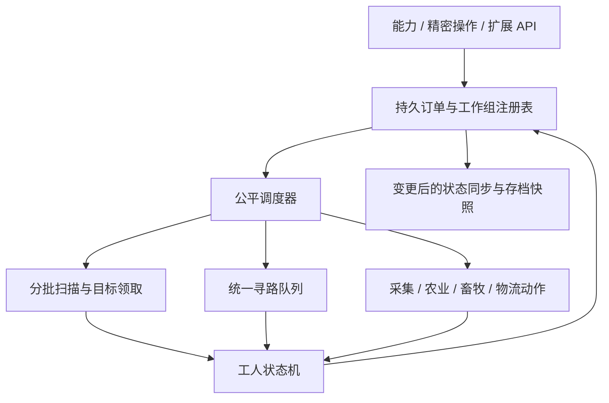

# 精神控制工作任务优化方案

日期：2026-09-30；实施更新：2026-10-01。状态：首轮核心实现已落地，验收记录及未完成项见 [实现与验证记录](mental_control_work_task_validation.zh-CN.md)。下文的性能数值是设计目标，不代表全部已经达标。

## 1. 目标与范围

优化广域干涉下的采掘、农业、伐木、甘蔗 / 竹子、清理、剪毛、挤奶、喂养和拾取搬运，以及这些任务共用的寻路、物流、暂停、恢复和保存流程。

核心目标：多人、多工作组并行时控制服务器 tick 开销，同时保证工人及时开始工作、持续取得进展，并正确保留物资与订单。预算不足应显示等待并继续排队，不能误判为不可达、完成任务或切换远程采矿。

沿用现有行为：单轴最多 32 格、单区最多 4096 格；真实材料消耗、默认铁质工具效果、真实装备优先；采矿距离策略、权限检查和已加载区块限制；暂停仍保留 AI 接管；控制者离线 / 工人卸载后挂起。扩大区域和离线模拟不属于本轮范围。

## 2. 当前实现与已确认问题

以下结论来自当前工作区源码静态检查。次数为代码路径上界或复杂度分析，不是本轮实测耗时。当前工作区已包含此前寻路、租约索引和空物品栈修复，应作为优化基线保留。

| 优先级 | 源码证据 | 问题与影响 |
| --- | --- | --- |
| P0 | `GroupControlNavigation.findNearestWorkPosition` | 工作站位有 14 个候选，通过 `min` 比较路径长度，可能全部调用 `createPath`。现有 4 候选、每维度每 tick 12 次限制只用于 `findNearestReachablePosition`。64 个同时寻找站位的工人理论上可触发 896 次查询，尚未包含实际移动。 |
| P0 | `StandardMobControlBindings.DestinationNavigator.advance` | 站位查询只返回坐标，移动阶段重新创建路径。失败重试最短间隔为 2 tick，动态目标位置更新间隔为 4 tick；这些 `createPath` 调用没有接入上述预算。有效路径已有复用，问题集中在建路、失败和重新规划。 |
| P0 | `GroupControlRuntime.tick` | 每 tick 遍历并推进全部任务，没有跨任务、跨工作组的总体工作量预算；多个订单的扫描、物流和寻路可能集中发生。 |
| P1 | `MiningWorkPlan.refresh/claim/resolve/progress` | 每组周期性整区扫描；每次领取遍历目标、重建作业面占用计数；每次 `resolve` 又遍历全部目标唤醒附近受阻项。大量已有目标同时变为排除项时，`refresh → resolve` 最坏接近 O(N²)。进度缓存会在每次领取等变更后失效。 |
| P1 | `SharedWorkPlan.refreshFiltered/claimNearest` | 农业虽然已共享扫描，但一次仍扫描整区；每名工人领取时线性寻找最近目标并线性删除。旧 `GatherResources` 路径中的 `nextMiningBlock` 还可能在一次调用内反复领取并丢弃失效目标。 |
| P1 | `tickAnimalWork/tickCollection/supplyTool` | 每个工人独立查询动物 / 掉落物，接近期间可能每 tick 重新选目标；喂养的“食物是否适用”判断会查询附近动物，并可在补给箱槽位循环内重复调用。未共享实体目标领取，多个工人可能追逐同一对象。 |
| P1 | `collectSeeds/depositWorkCargo/containerPositions` | 缺货、满箱等状态缺少统一退避；取用扫描容器槽位、投递尝试整批货物。旧农业收尾流程可能扫描整个区域找容器，缓存又缺少新增 / 拆除失效机制。部分旧路径缺少显式加载检查，需要统一入口。 |
| P0 | `setWorkPaused` 和 `DefaultTask.tick` | 暂停显式释放了采矿计划的领取，农业通用队列未做同等释放；高优先级抢占时也未统一释放领取，可能占住可交给其他工人的目标。 |
| P0 | `restoreOrders` | 每 20 tick 遍历全部持久订单、解析 UUID 并分组恢复。已运行任务被排除，稍后加载的同组工人会通过新一次 `dispatch` 获得独立共享计划，跨恢复批次不能统一领取。 |
| P0 | `cancelWork/finish` | 无运行中任务且控制者离线时，取消路径删除订单但没有安排货物去向；完成流程先删订单再返还货物，返还异常需要恢复策略。前者是公开 API 可达的分支，不代表当前在线 GUI 操作一定触发。 |
| P2 | `WideAreaInterference.Server.command(QUERY_WORK)` | 当前工作面板约每 40 tick 或选择改变时查询，服务端先对全部订单排序，比较器还对选中列表执行 `indexOf`，之后才过滤控制者和选中实体。 |
| P2 | `WorkSettings.matches` | 热路径反复解析过滤 ID、创建标签键；可在配置 / 数据重载时编译一次。 |

已有保护：`MentalControlRuntime` 已按受控实体建立租约索引；`WorkOrderData.Entry` 已过滤空栈并在写入和取出时复制货物；采矿已有共享领取、受阻计数和完成前复查。这些不是本轮需要从零补建的能力。

## 3. 总体结构

世界、实体、寻路和容器操作继续在服务器线程执行。按小步骤让出执行权；异步线程只允许编码已经冻结的数据或执行独立纯计算，不能直接读写活动世界和可变 `ItemStack`。

### 3.1 订单、工作组和工人分层

- 为新订单保存稳定 `orderId`、配置 `revision`，工人分配记录引用订单。暂停、重载和分批加载保留身份。
- 一个订单对应一个共享计划；同一订单后来恢复的工人加入现存计划。不同控制者、不同权限来源和独立下达的订单不因区域相同而直接合并。
- 索引分别按控制者、工人、订单和维度维护；查询、取消、权限作用域校验及恢复按索引定位。
- `Claim` 记录目标、工人 UUID、订单版本和领取代次。提交动作时再次校验领取，防止旧回调处理已分配给其他人的目标。
- 暂停、抢占、卸载、取消、死亡和替换订单均通过统一状态转换释放目标、取消过期请求；暂停继续保留现有 AI 接管语义。
- 事件触发恢复候选，另设低频、有游标的校验作为兜底。单次恢复也受预算限制，不能在上线或区块加载时一次激活所有工人。

### 3.2 调度与初始预算

按“控制者 → 工作组 → 工人”轮转，并加入等待时长优先，避免一个人拆成大量小订单挤占调度。不同维度共享服务器总上限，维度内仍有独立配额。取消和失效清理优先于新工作。

以下为第一版压测起点，必须按第 8 节实测调整，不是已验证参数：

| 操作 | 每服务器 tick 总上限 | 单次切片 |
| --- | --- | --- |
| 工作调度及受控导航的主动操作 | 2 ms 软时间预算 | 每个不可分割操作前后检查剩余时间 |
| 工人状态推进 | 128 次 | 一个状态的小步骤；不包括强制让全部原版 AI 停 tick |
| 方块重新分类 | 512 格 | 每工作组最多连续 64 格 |
| 实体候选检查 | 256 个 | 每工作组最多连续 32 个 |
| 目标分配比较 | 1024 次 | 每工人最多连续比较 32 个候选，保留续查位置 |
| 新建 / 重建路径 | 8 次，且单维度不超过 4 次 | 每请求每轮最多尝试 1 个候选，成功立即停止 |
| 容器槽位检查 / 实际转移 | 256 次槽位检查 / 64 次转移 | 每工人最多连续 16 次检查 / 4 次转移 |
| 方块或动物的实际工作动作 | 64 次 | 不补执行历史欠账 |
| 挂起订单恢复 | 8 个工人 | 每次完整初始化一个工人 |

所有计数预算服从剩余时间预算，并记录在哪一类耗尽。路径请求由普通定位、工作站位和执行导航共用入口，预留交互命令响应份额，同时保证后台工作有最低轮转机会；不允许三条路径各自使用一套可叠加的上限。

2 ms 是合作式软预算：原版寻路、模组事件或容器回调一旦开始，不能安全中断。因此必须记录单次最长操作与超额值；不能仅凭调用次数上限宣称 tick 有硬时间上限。若单次原版路径本身仍很慢，再依据测量限制搜索距离 / 节点规模或引入可恢复的搜索实现。

原版移动和必要的控制保持照常运行。挖掘进度按实际处于可工作的服务器时间计算，暂停、等待预算、缺料和抢占不累计；动作落地仍每次最多一次，不能因积欠时间瞬间完成一批方块。对已有导航，只有实际请求被延后时冻结该请求的失败计时，不能掩盖真实卡路。

## 4. 寻路优先优化

1. 将站位计算和执行导航统一为请求，返回 `READY / DEFERRED / NO_PATH / UNLOADED / INVALID`。`DEFERRED` 表示预算排队；上层保持任务和近身策略，不计寻路失败、不触发自适应远程回退。
2. 候选先做加载、碰撞、距离及移动类型筛选。优先尝试最近少量候选，第一条满足到达距离的有效路径即可使用。
3. 单轮优先候选最多 4 个，但失败后保留其余合法候选的后续轮次；未尝试完不能把“本轮未找到”当成整项不可达。保留现有特殊实体直线运动适配和碰撞检查。
4. 返回的路径直接交给同一工人的导航使用，匹配目标、导航器和到达半径，消除“先测路径，再按坐标重新寻路”。`Path` 有可变游标，禁止跨工人共享同一个实例。
5. 有效路径继续复用；目标足够移动、路径失效、地形改变或实际停滞时才申请重建。等待期间可继续走仍有效的旧路。
6. 不可达结果按工人体型、移动类型、起终区域和地形版本短期缓存，失败退避建议 10 → 20 → 40 → 80 tick，并加确定性错峰。关键地形变化、换目标和用户重新下令可提前唤醒；成功会清除失败历史。
7. 不持久保存失败的空站位缓存。`workApproach` 应记录失败原因与过期 tick，输出箱周围后来变得可达时能自动恢复。

寻路请求携带订单版本和目标领取代次；暂停、取消和卸载后返回的旧结果直接丢弃。

## 5. 各工作模式优化

### 5.1 采掘、伐木、甘蔗 / 竹子、清理

- 每个工作组维护分区扫描游标，优先发现附近可工作面；采掘仍遵循上层、暴露面、作业面分散及距离的既有优先原则，分批扫描不得悄悄改变距离策略。
- 自己修改的方块及邻近位置进入脏队列；接入可用的世界变更通知，同时保留低频滚动复查，覆盖其他模组的直接修改和随机更新。扫描逐步扩大，不能每次移动工人就从头扫描。
- 目标按高度、暴露状态和局部工作面分桶；作业面占用和进度计数增量维护，领取时只比较局部有界候选。
- `resolve` 只更新本目标及空间索引中的附近受阻目标，避免每次处理全区；大批外部变化也经同一预算队列处理。
- 增量扫描未结束、目标仍被领取、受阻或区块未加载时均不宣布完成。完成前进行一轮有版本标记的分批复查：新脏项必须处理完，世界变化使相关复查结果失效。
- 旧 `GatherResources` 也接入同一个调度内核，避免保留可以无预算耗尽整个队列的兼容路径。

### 5.2 农业

- 成熟作物、待翻耕土壤、待播种位置分开索引，目标领取复用通用 `Claim`。
- 收获与补种优先连贯处理；保留种子预留量，材料不足时转入等待，不每 tick 重扫箱子。
- 自己收获 / 播种后直接更新索引；成熟检测分片轮询并结合可用的变更通知。
- 暂停和抢占后目标可以被其他工人领取。工人恢复时重新领取，不能继续提交旧领取。

### 5.3 剪毛、挤奶、喂养、拾取搬运

- 每个工作组共享实体候选索引和短期领取。动物以 UUID 校验身份，掉落物处理合并、数量变化、拾取延迟、卸载和 ID 复用。
- 工人保留目标直到失效、完成或明确放弃；接近期间只做廉价有效性检查，避免反复整区查询和换目标。
- 喂养先确定可服务的动物候选，再判断手持食物及补给槽位是否适用；每检查一个槽位不得再触发一次全范围动物查询。
- 操作前重新校验实际物品、距离、动物状态、过滤条件和权限。剪毛 / 喂养的状态改变立即失效候选；挤奶保留现有真实空桶消耗与动作间隔，不擅自增加产量限制。
- 复用已有泛型 `SectionEntityIndex<T>` 的分区及游标能力，并按工作区域过滤。现有 `AreaQueryService` 面向 `LivingEntity`，不能直接用于 `ItemEntity`；为区域盒查询和掉落物补充适配，复用索引时明确维护者及生命周期，避免重复全世界维护。
- 工作调度独立记录成本，同时统计与流场感知、真空领域同时运行的 Academy 总开销；不能把两个系统各自达标当作整服预算达标。

### 5.4 物流和过滤

- 货物、材料查询、取用、投递拆成可恢复的小步骤；没有可转移物品时按照容器版本或退避时间唤醒，避免满箱时循环投入同一整批货物。
- 容器不保证提供可靠的通用变更版本。可追踪自己的转移和已知通知，第三方容器另保留低频校验；执行前总是重验物品和容量。
- 缓存容器位置 / 能力描述，不长期持有已卸载方块实体；打开、拆除、替换或卸载时失效。旧农业收尾查找也须分批执行、检查加载状态。
- 统一货物堆叠和容量管理，保留现有 18 堆触发投递语义。模组一次产生超额掉落时应全部接收后优先清空，不能按预算截断或丢弃已生成物品。
- 不跨 tick 缓存可变的实际槽位引用，不在异步线程执行容器插入 / 提取。按实际返回数量确认转移，部分成功可继续，失败不能清空原货物。
- `WorkSettings` 编译为对应注册表的过滤谓词，配置变更和数据重载后重建，保留 ID / 标签及允许 / 排除列表语义。

## 6. 保存、恢复和异常退出

### 6.1 本轮必须修复的逻辑一致性

1. 将货物交付作为明确状态：`ACTIVE → RETURNING_CARGO → COMPLETED/CANCELLED`。货物无去向或交付失败时保存待返还记录；控制者离线且工人未加载时不能直接删除带货订单。
2. 恢复先装配持久身份、暂停状态和货物，再发布运行任务 / 激活对应控制；避免初始化保存覆盖尚未装配的数据。恢复幂等，同一分配只能恢复一次。
3. 保留 `WorkOrderData` 空栈过滤和防御性复制；只在货物、分配、配置或暂停等实际持久状态改变时替换快照。内存快照去重不能取消存档边界的复制保护。
4. 导航句柄、缓存、待处理路径和领取不直接序列化；恢复后按当前世界重建。保持暂停、距离策略、真实货物和控制归属准确。
5. 订单数据增加版本。旧数据按控制者、来源、区域、配置及优先级迁移到稳定组身份；旧格式本来不能区分的相同配置订单，沿用既有恢复分组语义。迁移可重复执行但不会复制货物。
6. 失败项保留错误状态及原始数据供重试；统一限频汇总重复错误，首次异常保留堆栈，不能每 tick 重复全堆栈，也不能用删除订单掩盖异常。

### 6.2 崩溃保存的明确边界

`WorkOrderData.put()` 当前调用 `setDirty()`，表示进入待保存状态，不能据此保证本次动作已落盘。已有 `persistent_work` 游戏测试覆盖编码和运行时重建，尚不能证明强制结束进程后的磁盘恢复正确。

工作订单、实体装备、玩家背包、输出容器和世界方块属于不同保存对象；“订单先删还是后删”的内存修复无法提供跨文件原子性。单独给订单追加日志也无法保证物品绝不重复或丢失。例如箱子转移落盘而货物扣减未落盘，直接重放会复制物品。

本轮措施：接入正常保存生命周期，验证快照进入保存的时机；在测试副本中于取材、收获、投递、返还和恢复节点注入异常 / 强制退出，记录实际可恢复边界与损失窗口。普通流程及一致保存点后的重启必须无丢失、无重复。

若强制退出实验仍显示跨存储不一致，单列后续持久化阶段：需要能与参与存储协调的提交记录、幂等事务标识和恢复核对策略；第三方容器无法提供幂等能力时保留待核对记录，禁止盲目重放。第一阶段不承诺断电或进程强杀零回滚。

玩家能力主数据仍由独立保存系统管理；本方案中的工作订单测试不能替代玩家能力保存回归。

## 7. 状态反馈与公开扩展

- 工人状态区分扫描、排队寻路、前往目标、工作、补给、投递、缺料、满箱、无路径、区块未加载、被抢占、暂停和待返还，避免全部显示“工作中”或“路径错误”。
- 第一阶段保留现有面板结构，状态查询改成按控制者及所选工人索引读取，去掉全表排序；配置仅在版本变化时重新编解码。
- 第二阶段按订单版本合并状态变化，保留低频完整同步和重同步入口；限制批量字节数，面板关闭后停止详细订阅。进度使用增量计数，统计“扫描中”时不伪装为最终总量。
- 通用能力放到 `org.academy.api.common.entitycontrol` 或服务器 API：预算申请、可恢复查询结果、目标领取和任务状态接口。内部运行时实现放在 `org.academy.internal`。
- 保持现有 `GroupControlApi`、`GroupControlRequest` 调用兼容；后续增补包含控制者身份、权限、物资访问和生命周期的执行上下文，由 `ServerPlayer` 适配。精密操作及非玩家控制者复用同一执行器，不能通过传空玩家绕过权限和材料规则。

## 8. 验证与验收

### 8.1 建立可比较的基线

固定 JVM、硬件、世界、实体类型、模组集合和工具材料，对当前工作区基线与每个阶段分别记录。预热后采样至少 5 分钟；单独采样冷启动、集中加载和完成复查峰值。

基础测试档位：

| 档位 | 工人 / 工作组 | 重点 |
| --- | --- | --- |
| 日常 | 1、16 / 1、4 | 近处立即发现目标、单工人效率、无必要延迟 |
| 主要验收 | 64 / 4 | 各模式混合作业、每组最多 4096 格、物流竞争 |
| 饱和压力 | 128 / 32 | 公平性、累计等待、吞吐，允许降速但不能饿死任务 |
| 高实体背景 | 上述主要验收档 + 4224 个常驻实体 | 区分附近匹配候选和世界背景实体，覆盖动物及掉落物密集区 |
| 多控制者 | 8 位实际客户端；32 位另作扩展压测 | 多人命令 / 同步、跨维度竞争与总预算；模拟 UUID 结果单独标注 |

测试地形包含平地、障碍、窄通道、大型工人、不可达目标、卸载边界和边工作边改地形；旧 64 工人 / 4096 方块区域采矿用例不足以覆盖近身寻路压力。

### 8.2 性能目标

- 主要验收档：工作系统总成本 P95 目标 ≤ 2 ms / tick、P99 ≤ 4 ms / tick；统计跨事件调用的导航、扫描、索引维护、恢复和状态编码，不只测调度循环。总 MSPT 和单次最慢回调另报。
- 空闲或材料短缺时不得维持逐工人全区扫描；计数预算零违规，预算耗尽不增加寻路失败数。
- 主要验收档：可用目标首次发现 P95 ≤ 10 tick；可达、未被抢占的工人首次获得寻路服务 P95 ≤ 40 tick。分别测服务等待、实际到达和动作完成，不能混成一个指标。
- 方块扫描计数预算为 512 时，单个 4096 格区域理论最少 8 tick，32 个满区域理论最少 256 tick；软时间预算和其他操作还可能延长。单组初次完整核对目标 ≤ 20 tick，饱和档全量核对目标 ≤ 400 tick，并优先服务已发现的附近目标。
- 在专门的“持续有就绪任务”饱和用例中，等待时长 P99 目标 ≤ 100 tick；长期没有目标、缺料或不可达的外部等待单列，不能混入调度排队等待。
- 保持同等工具、距离模式、材料和地形，1 / 16 工人的每分钟完成量相对基线下降不超过 10%；64 工人必须同时报告总完成量、每组完成量、寻路次数和等待分位数。未满足时继续调优，不能仅以不再崩溃通过验收。
- 容量上限是限制每 tick 的处理量；不因预算丢掉待办目标或静默拒绝第 65 个工人。遇到需保护内存的容量限制时应明确拒绝新订单并反馈，保留已接收任务。

以上均为待测目标；路径、事件等不可中断回调超额时必须报告，不能从统计中删除。

### 8.3 正确性与恢复用例

- 重用现有 `MiningWorkPlanTest`、区域 / 配置 / 包测试及工作 GameTest；补充预算延后与真实无路径区别、暂停 / 抢占释放、恢复批次共享、旧领取失效和扫描中不能完成。
- 大批方块被外部清除后复查，断言每 tick 分类 / 邻域更新工作量有界；更改地形后失败缓存及时失效。
- 工人靠近不同候选、动物移动、掉落合并、容器替换、权限变化、工具损坏、补料、满箱和数据重载均能正确恢复。
- 货物守恒账本覆盖实际生成、消耗、箱内、工人携带、玩家背包和掉落实体；测试离线取消、死亡、卸载、异常返还及订单替换。
- 保存到磁盘、正常重启、强制退出、旧存档迁移分别验证，不用单纯 Codec 往返替代。玩家能力保存另设回归。
- 开发阶段依仓库要求执行 `test -DisDev=true`、开发 / 发布两种 `build`、`runClientDev` 实机检查，并在专用服务器进行压力和恢复测试。同一版本成功检查可以复用。

## 9. 实施顺序

1. **阶段一：堵住寻路峰值并修正任务生命周期。** 加计数 / 耗时观测；统一寻路入口、可恢复结果、路径复用和公平排队；接入基本工作预算；修复暂停 / 抢占领取、分批恢复与离线带货取消。先覆盖真实近身工作及异常恢复。
2. **阶段二：降低扫描与物流成本。** 增量方块索引、目标分桶、常数时间进度统计、实体共享领取、喂养查询解耦、物流切片 / 退避、过滤编译；迁移兼容工作模式。
3. **阶段三：完善反馈与整体验收。** 索引化状态查询 / 变更同步，完成混合技能、跨维度、多控制者实测，调整默认预算并形成数据报告。崩溃磁盘实验发现的问题决定是否进入独立的持久化协调阶段。

每个阶段交付可独立验证的完整功能，不等待大型重构结束才验证。2026-10-01 已实现统一预算、共享扫描与领取、物流切片、订单恢复和待返还状态。具体覆盖、测量范围及尚未执行的压力档位以实现与验证记录为准。

## 10. 主要源码入口

- [工作任务运行时](../src/main/java/org/academy/internal/common/ability/mentalout/control/GroupControlRuntime.java)
- [站位与寻路辅助](../src/main/java/org/academy/api/common/entitycontrol/GroupControlNavigation.java)
- [实际实体导航](../src/main/java/org/academy/internal/common/ability/mentalout/control/StandardMobControlBindings.java)
- [采矿共享计划](../src/main/java/org/academy/api/common/entitycontrol/MiningWorkPlan.java)
- [工作订单存档](../src/main/java/org/academy/internal/common/ability/mentalout/control/WorkOrderData.java)
- [工作配置与过滤](../src/main/java/org/academy/api/common/entitycontrol/WorkSettings.java)
- [广域干涉命令入口](../src/main/java/org/academy/internal/common/ability/mentalout/skills/lv5/WideAreaInterference.java)
- [工作 GameTest](../src/main/java/org/academy/internal/common/ability/mentalout/gametest/MentaloutGameTests.java)
- [既有工作行为说明](wide_area_interference_work_modes.md)
