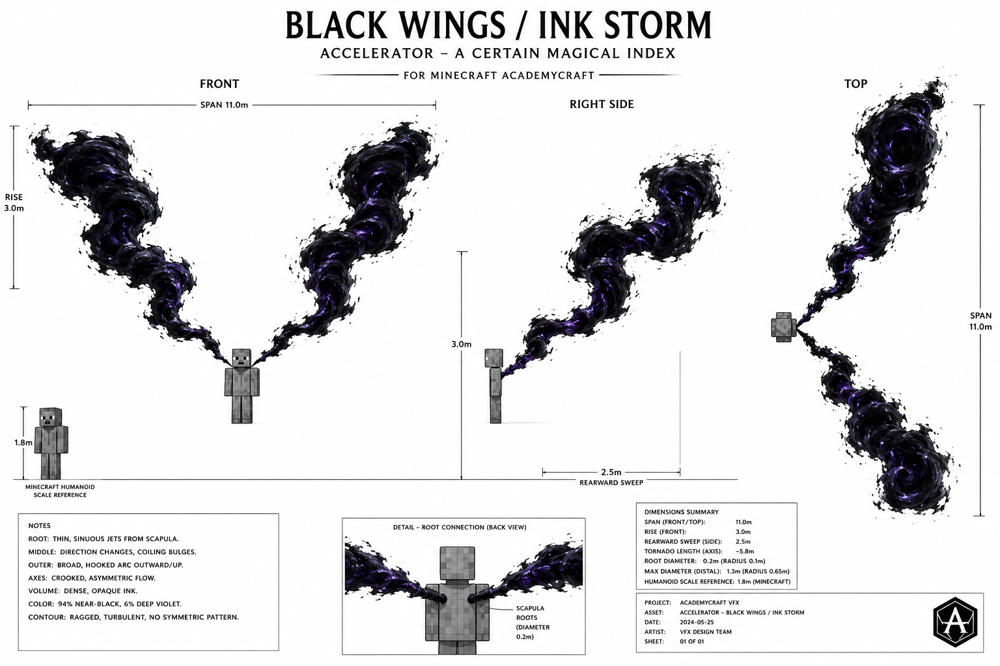
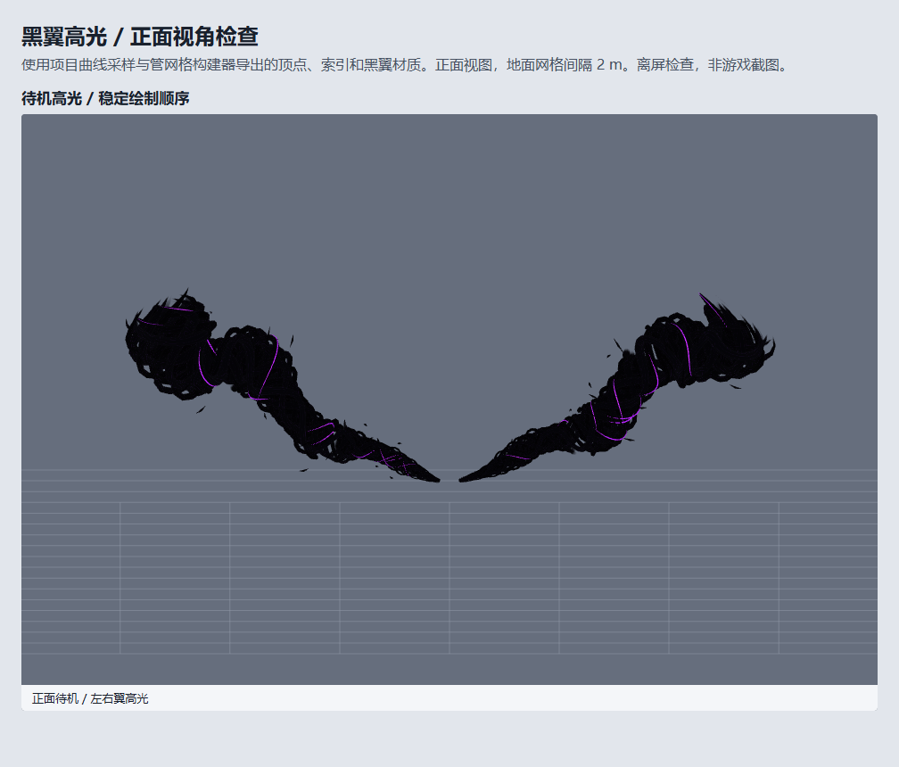
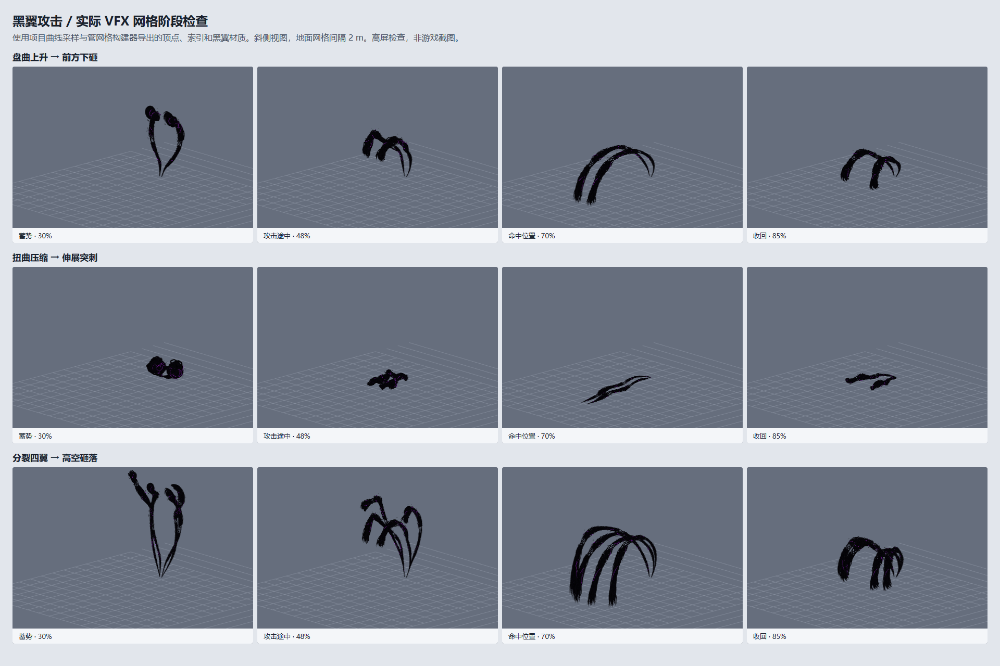

# 黑翼：弯曲墨流风暴

## 设计依据

按用户提供的漫画、动画截图，黑翼从两侧肩胛喷出，主体是密集墨黑气流汇聚成的两条狭长龙卷。
根据两轮反馈，去掉动物翅膀的扇面、羽片轮廓，也去掉过直的圆锥主轴。新轮廓有连续弯折、
旋涡鼓包和收窄段，左右以不同相位变化。形状经用户确认后保留，增加沿细流外移的亮紫短带，
并在密集墨流中加入局部镂空，空隙仍有少量外层细流贯穿。

网络参考（2026-09-05 检索；作品社区资料，不作为官方设定文献）：

- [Accelerator / Abilities](https://toarumajutsunoindex.fandom.com/wiki/Accelerator/Abilities)：黑翼的背部喷流表现及不同登场阶段。
- [Awakening](https://toarumajutsunoindex.fandom.com/wiki/Awakening)：巨大黑翼及后续白翼变化。

最终以用户截图和反馈为外观依据。约 11 米展幅、3 米抬升和 2.5 米后掠是模组的视觉设计尺度，
并非对原作尺寸的断言。生成图为美术方向参考，各视图尺寸标注不用于精密测量。

## 编辑与实现

用项目 VFXGraph Editor MCP 创建、编辑并验证 `academy:vfxgraph/black_wings`。
运行 `./gradlew runGraphEditor -DisDev=true`，打开 `black_wings` 即可继续编辑。

- `left_vortex`、`right_vortex`：两个独立的 `vfx.block.vortex_jet`。
- `length`、`rise`、`back`、`radius`：长度、抬升、后掠和漏斗粗细。
- `turns`、`speed`、`phase`：螺旋圈数、流速和两侧扰动相位。
- `filaments`、`segments`、`flecks`：每侧细流、曲线采样和游离墨屑预算。
- `color`：墨色基底；材质 `vfxgraph_ink_storm.fsh` 控制少量深紫夹缝。
- `highlight_count`、`highlight_speed`、`highlight_color`：每侧亮带数量、外移速度和亮紫颜色。
- `hollow`：局部镂空强度（0 关闭，1 最大）；实际切断空隙处的三角面连接，保留部分细流桥接。
- 图参数 `sweep_left/right`、`pitch_left/right` 保留为编辑器姿态控制；游戏黑翼攻击使用下述连续形变参数；
  `radial_scale`、`length_scale`、`spread_scale`、`opacity` 支持过渡收束。

每侧一条带局部开口的核心、18 条螺旋细流和 24 条短墨屑；左侧 14 条、右侧 10 条移动高光，共 110 条曲线。
高光沿现有螺旋细流外表面移动，宽度为墨流管半径的 20%，并限制到 0.012 米，避免末端粗大紫条。
相比最初每侧 8 条，先调整到每侧 10 条、每条覆盖长度增加 4%，合计覆盖密度约提高 30%。右侧效果经用户确认后保留，左侧再补至 14 条以改善稀疏感。
两处镂空宽度缩至原来的约 45%，中心沿轴向缓慢往返移动，各细流边缘错开，且每三条保留一条连续桥接。
高光端部渐细并淡入淡出，主体仍保持墨黑。
几何按发射块所属组替换，不积累上一帧副本。细流沿主轴旋转外喷，主体曲线慢速弯折。
不使用羽毛模型、静态贴片翅膀或旧黑翼圆环。

公开采样器 `org.academy.api.client.render.vfxgraph.shape.VortexJetGeometry` 不依赖玩家或技能，
可以供其他发射器、实体和后续能力系统复用。局部坐标 +Y 向上、-Z 向后。

`WingVfx` 把新图接到角色模型根矩阵的肩胛位置。第一人称使用世界空间肩胛位置，
攻击风暴会进入视野；第三人称沿用已捕获的角色飞行姿态。世界空间目标点转换回发射器局部坐标，角色移动、转身或倾斜时仍指向同一目标。黑转白沿用既有过渡时间线并取消攻击形变。
白翼、白金翼、风暴之翼的渲染实现保持原有路径。

## 正面高光修复

`ArcBuffer.removeGroup` 原先用交换删除。第二个发射器删除旧曲线时会反转第一个发射器刚添加的曲线，
透明材质又不写深度，导致左翼核心在高光之后绘制并遮盖它。现改为 O(n) 稳定压缩，复用曲线对象，
保留存活曲线顺序。回归测试连续检查左右翼的核心始终先于高光绘制。图为实际网格/材质的离屏渲染，非游戏截图。

## 三种攻击

参考用户指定的[一方通行 vs 上条当麻](https://www.bilibili.com/video/BV1XK411H7a7)第一部分：
已通过公开播放接口读取第一部分并检查 84–91 秒、96–103 秒、161–172 秒的连续帧；
参考视频和临时分析帧仅保存在忽略的 `build/black_wing_reference`，不作为模组资源分发。

1. `black_wings_rise_slam`：对应 1:25 起。两股墨流盘曲上升，前端翻转并朝瞄准点砸下。
2. `black_wings_compressed_thrust`：对应 1:37 起。肩后扭曲压缩，随后伸成长而尖的前向突刺。
3. `black_wings_fourfold_slam`：对应 2:42 起。每侧分为两股，升向高空后错峰砸向前方地面，再收回两翼。

三个独立图是可直接打开、循环播放的编辑器预览，使用同一个公开 `VortexAttackGeometry` 采样器。
游戏中由 `BlackWing.Server` 在成功接受攻击后选择下一招，并通过 `BlackWingAttackPacket` 广播
模式、服务器起始 tick 和世界空间目标点。顺序为上升下砸 → 压缩突刺 → 四翼砸地 → 重复。
失败的攻击请求不推进轮换。停用技能、切换世界和退出游戏会清理攻击播放状态。

保留原攻击伤害、扇形命中判定、费用及 10 tick 触发间隔。本轮仅替换攻击视觉，三招的伤害范围并未分别重做。
上升下砸/突刺跟随瞄准射线最先遇到的实体或方块；四翼砸地再向下查找实际地面。
特效中的落点与墨屑不破坏方块。游戏动画按现有攻击节奏压缩到 10 tick；编辑器预览放慢为两秒循环以观察阶段。

- `attack_mode`：0 待机，1 上升下砸，2 压缩突刺，3 四翼砸地。
- `attack_progress`：0–1 为动作进度；负数用于编辑器自动循环。
- `attack_target_x/y/z`：发射器局部空间的目标点；由游戏中的世界目标换算。
- 四翼期间最多 220 条曲线，结束恢复 110 条，无持续堆积。

## 验证记录

- `./gradlew test -DisDev=true`：通过，含持续播放、左右横扫隔离、收束和恢复，以及高光位移、宽度上限、镂空大小、位置波动和桥接细流测试。
- `./gradlew build -DisDev=true`：通过，包含编辑器测试。
- `./gradlew build -DisDev=false`：通过；完整测试共 1609 项，0 失败、0 错误。
- MCP 图结构校验：主图与三个攻击预览图通过，0 错误、0 警告。
- 实际曲线和管网格导出后，使用相同片元材质做离屏渲染，目视检查正面双翼高光和三招阶段。桌面截图工具因 `apply deny-read ACLs` 初始化失败；离屏图不替代游戏内验证。
- 回归测试覆盖高光绘制顺序、三招蓄势/命中/返回、四翼分裂与回收、瞄准方向、曲线预算、非数值异常，以及招式/时间/目标的数据包往返。
- `./gradlew runClientDev -DisDev=true`：本轮客户端成功完成模组、纹理及单人世界加载；此前那次 GLFW 原生崩溃未在此次启动阶段复现。
  由于桌面控制工具不可用，未完成进入世界后的三招连击、飞行姿态和黑转白操作验证；这些仍需实机复核。
- 新编辑器已加载三个攻击图；上升下砸和突刺播放为 110 条曲线，四翼砸地为 220 条曲线，三者均无 previewError。

## 绘图记录

先按 api2img 技能调用配置服务，但其返回 `403 INSUFFICIENT_BALANCE`，未生成图片。
三视图改由内置 image_gen 生成，并按用户两次反馈迭代，最终文件为 `three_view.png`。
最终提示词要点：同一对圆截面墨黑长龙卷的正面、右侧、顶部视图；两处肩胛细喷流；
明显 S 形弯折和不规则粗细变化；黑色为主、少量深紫旋流夹缝；无羽毛、翼膜、扇形翼面、
笔直圆锥、规则圆环或大面积发光；小型 MC 人形用于比例参照。
