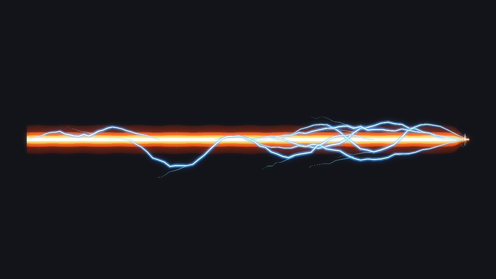
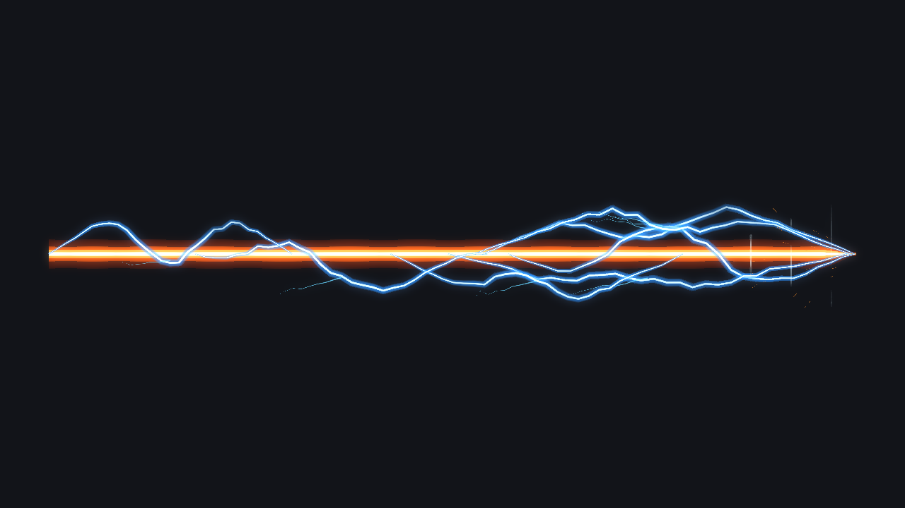
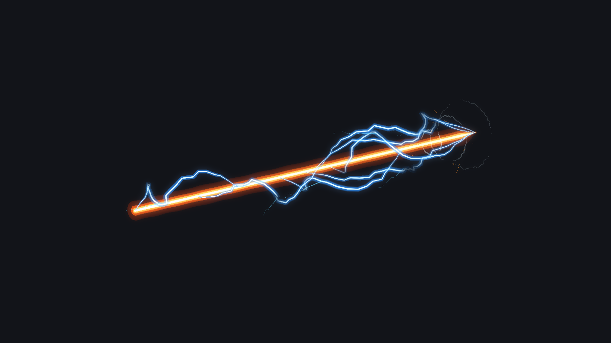
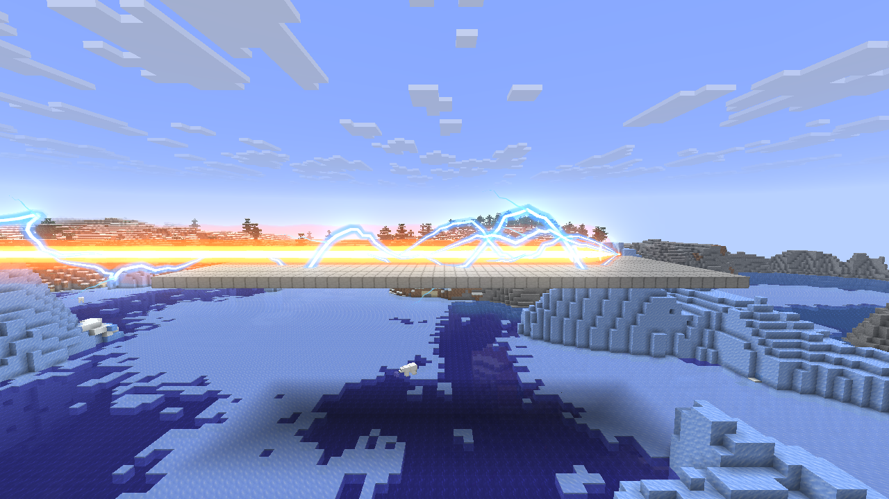
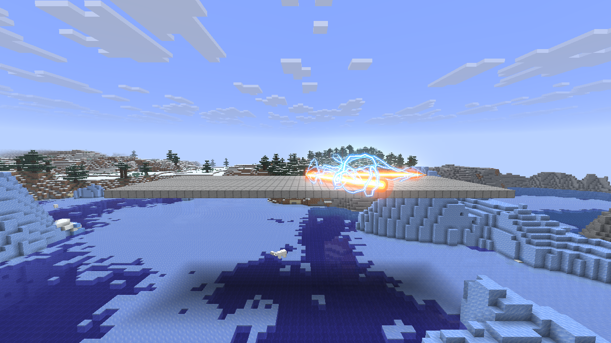
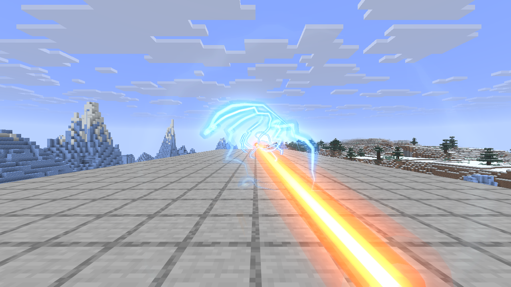
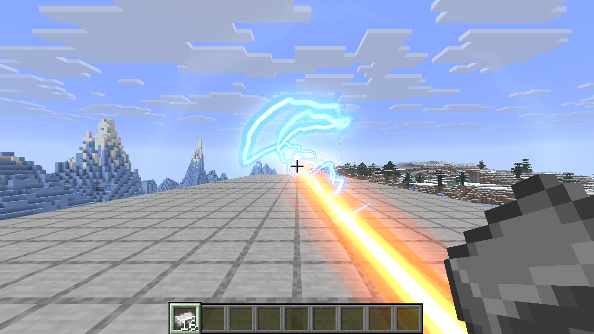

# 超电磁炮发射 VFX

2026-09-13。使用项目 VFXGraph 编辑器的资产写入、校验、模拟器、管线和辉光制作，并接入原有 `RailgunRay`。参考上传的 24.7 秒动画视频及三张截图；提供的 B 站 UE4 视频页面未能读取。

## 表现

- 四层橙红外晕、橙色外焰、金色内焰、白热炮芯；手部入口收细，远端保持完整柱径并以平底圆形端盖封口。
- 降低橙色外焰和金色内焰的透明度；16 边圆柱剖面、环向明暗及分层色彩增强体积感。暖色材质保留掠射角可见度，防止第一人称远端因侧面角度衰减而消失。
- 蓝白电弧在三维空间折返、分叉、闪烁；弹药倍率提升时变粗、向外扩展并适当增加密度。
- 断开的压力环和向外飞散的金色火星；起点不使用星形闪光。
- 第一人称保留从实际手部位置到远处的连续橙色轨迹。靠近起点时减少气浪亮度，并让近端先保持细束，沿路径逐渐恢复弹药粗细，避免重弹药的近端光晕遮挡视线。
- 第一人称使用单一的凹向粗细过渡，避免近端收细与恢复曲线叠乘形成中段鼓包；在半格手部前移的实际投影下，四层光柱的画面宽度从近到远不会再次膨胀。第三人称仍使用原有的世界柱径和细微波动。
- 炮束四层统一加粗 60%（基础半径由 0.52 调整为 0.832），与弹药倍率、半径曲线相乘。高射程保留近手部电弧，并由相互重叠的远端电弧覆盖到射程终点。
- 默认寿命从 1.1 秒延长到 1.6 秒（增加 10 tick），射线实体的保留时间同步从 30 tick 延长到 40 tick。半径从 0.18 倍开始，约 0.077 秒扩张到 1 倍，约 0.242 秒收束到 0.56 倍；新增时间用于中段保持，发射节奏不变。

[原速及三倍慢放预览](preview.mp4)

## 尺寸和技能扩展

图资产：`src/main/resources/assets/academy/vfxgraph/railgun_shot.json`。

| 参数 | 来源 / 用途 |
| --- | --- |
| `length` | 每个服务端已解析路径段的实际长度，单位为格；包括技能射程修正和反射截断 |
| `width_scale` | 弹药的 `getBeamWidthMultiplier()`，独立于长度 |
| `radius` | 图的基础视觉半径，当前为 0.832；所有炮束层统一缩放 |
| `radius_envelope` | 归一化生命周期上的“小 → 大 → 中”半径曲线 |
| `beam_opacity` / `arc_opacity` | 炮束与电弧的独立衰减曲线 |
| `duration` | 动画时长，默认 1.6 秒，节点范围 0.05–2 秒，受射线实体寿命约束 |
| `detail` | 电弧及气浪细节预算；低细节仍保留完整炮束 |
| `seed` | 来自射线 UUID；相同种子和时间给出相同几何 |
| `muzzle` | 反射段关闭再次发射的近端气浪及火星 |
| `view_near_origin` | 相机靠近起点时的视觉清晰度权重，运行时自动计算；编辑器默认 0 |

长度和粗细分别传入图，未用整体模型缩放去拉长所有细节。长炮束的两端单独分配采样点，保持近端形状；远端不再收尖，端盖位于解析路径的终点，不延伸到射程之外。近手部电弧使用独立的固定尺度，远端电弧按相互重叠的分段覆盖实际射程，电弧数和分段数有上限。运行时为整条路径设置剔除包围球，远裁面随长度扩展。

当前技能档位保持以下行为；这里的射程为技能修正前的基础值，伤害倍率还会与能力强度及玩家倍率相乘：

| 弹药 | 基础射程 | 光柱粗细倍率 | 服务端伤害半径 | 档位伤害倍率 |
| --- | ---: | ---: | ---: | ---: |
| 硬币 | 50 | 1 | 0.125 | 0.8 |
| 铁锭 | 58 | 1.5 | 0.1875 | 1 |
| 铁块 | 66 | 2 | 0.25 | 1.5 |
| 铁砧（含受损铁砧） | 74 | 2.5 | 0.3125 | 2 |

视觉半径曲线只控制渲染。伤害、命中半径、射程修正和反射命中仍由原服务端技能处理。此次移除了该技能旧的固定圆柱和额外电圈，避免与新图重复绘制。

通用节点位于公开 API `AxialBurstEmitter`：`beam`、`discharge`、`shock` 都沿局部 +Z 构造效果，不依赖玩家或弹药枚举。其他技能或非玩家实体可通过 `VfxGraphManager.spawn`、图参数和世界变换使用这些节点。新弹药沿现有射线接口提供实际长度与粗细即可。

## 编辑和复现

1. 使用 JetBrains Runtime 25 运行 `./gradlew :editor:runGraphEditor -DisDev=true`，打开 `railgun_shot.json`。
2. 在参数面板调整 `length`、`width_scale`，或编辑 `radius_envelope` 曲线。`time=-1` 使用自动播放时间。
3. 四个炮束层可分别调节 `radius_scale`、`intensity`、`end_cap` 和 RGB；电弧节点可调 `spread`、`arc_width`、`arcs`、`arc_reach`、`flicker_rate`。`arc_reach` 控制近手部电弧的参考长度；更长射程由远端电弧分段覆盖。
4. `node tools/vfxgraph-editor/scripts/author-railgun.mjs` 可通过编辑器仓库 API 重建这份初稿；当前图会被备份到 `run/academy/vfxgraph-mcp/backups`。

GPU 截图：`./gradlew :editor:runRailgunCapture -DisDev=true`。

游戏验证：`./gradlew :editor:runRailgunClient -DisDev=true`。使用隔离目录 `run/railgun-client`，需先将开发测试存档复制为该目录下的 `saves/railgun`；此次复制自已有 `run/sky-strike-client/saves/sky_strike`。验证辅助代码仅属于 editor 源集，不进入模组包。

## 验证结果

- `test -DisDev=true`：2084 项通过，包括四档尺寸、长度/粗细独立组合、512 格与 12 倍宽度、近端电弧位置稳定与远端覆盖、第一人称近端收细与远端恢复、近远投影宽度单调性、平底端盖法线/索引/池化复用、半径曲线与延长寿命、固定时间跨帧率一致性、参数变化、倒放采样与清理检查。
- `editorTest -DisDev=true`：103 项通过；编辑器仓库 Node 测试 5 项通过。
- 开发版、发布版 `build` 均成功，包含额外 JVM 配置检查。
- GPU 预览覆盖小、大、中、余辉、清空及俯视；按 60 fps 捕获完整生命周期。
- 真实 NeoForge 客户端接收服务端射线实体，验证四档弹药、反射双图、第一人称、提前删除、512 格 / 6 倍粗细，以及实际持铁锭蓄力释放，共 9 个场景。真实技能射线从相对玩家 `(-0.4, 1.2, 0.5)` 的右手位置发出；发射阶段不再叠加旧第一人称充能手环。自然结束及提前移除后活动图数量均归零。
- 发布 jar 包含图、着色器和运行时代码，不含 editor 捕获/验证类。未修改生成资源。
- 修复了编辑器现有启动入口的可见性：NeoForge DevLaunch 通过反射查找 `public static main`，原入口缺少 `public` 会阻止编辑器启动。

截图中的场地是隔离验证存档。尺寸和反射压力测试采用模拟射线实体；`ingame_hand_cast.png` 使用真实技能的客户端开始/结束充能消息。未改变弹药数值或扩大服务端伤害范围。
