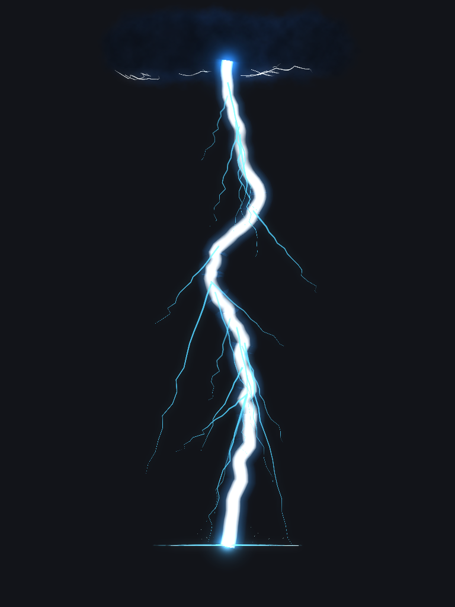
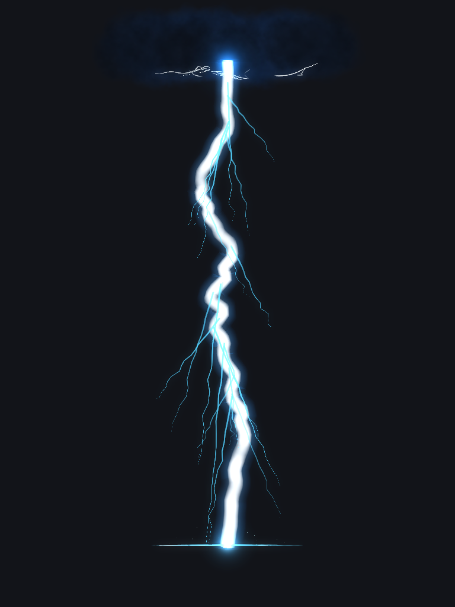
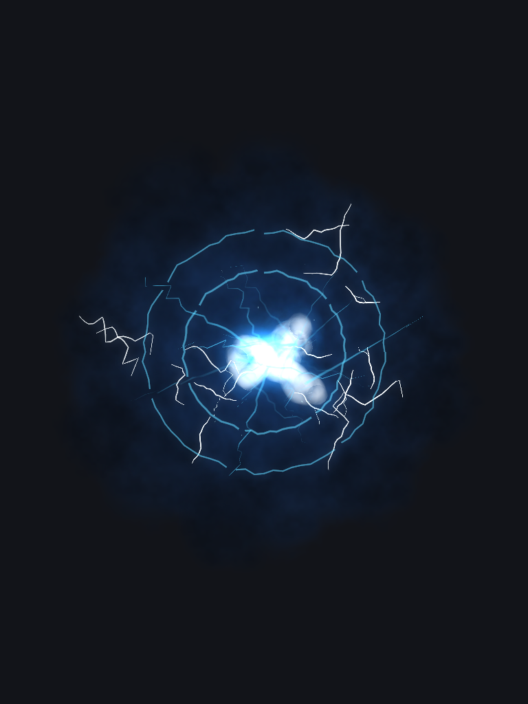
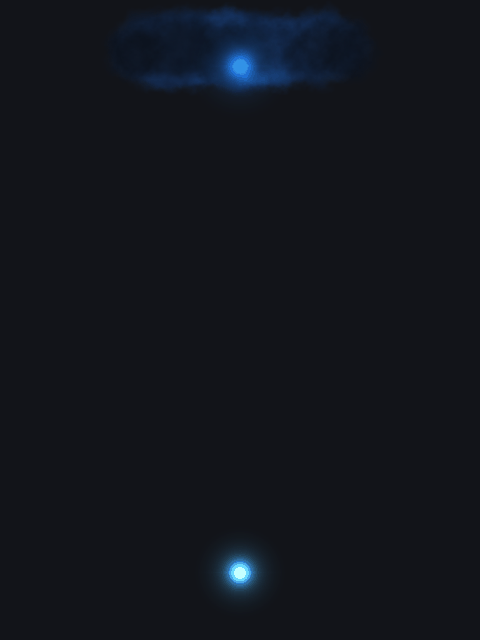

# 落雷特效重做

## 最终表现

雷击与闪电风暴均已从竖直占位纹理切换为 VFXGraph：立体白色雷芯、青蓝辉光、深色云团、贴地与贴云电弧、贯地冲击及火花。

| 项目 | 雷击 | 风暴中的单道落雷 |
| --- | --- | --- |
| 云底到落点高度 | 72 格 | 48 格 |
| 主干半径参数 | 1.55 | 0.65 |
| 云盖主体半径 | 20 格 | 11 格 |
| 主干水平扭曲幅度 | 7.2 | 3.2 |
| 晃动窗口 | 生成后 0–0.2 秒 | 生成后 0–0.2 秒 |
| 主雷柱寿命 | **0.8 秒**：通电 0.4 秒，渐隐收束 0.4 秒 | **0.6 秒**：通电 0.25 秒，渐隐收束 0.35 秒 |
| 地面、云层附着电弧 | **1.5 秒**，末 0.45 秒渐隐 | 同左 |
| 整体视觉寿命 | 3.4 秒 / 68 tick | 同左 |
| 地面附着范围半径 | 14 格 | 6 格 |
| 伤害范围 / 冲击圈标称半径 | **14 格** | **6 格** |

主干轻微上细下粗：云端为 0.88 倍半径、落点为 1.10 倍，落点约粗四分之一，另外叠加 7% 局部宽度起伏。白芯与青蓝外缘保持相同锥度。前 0.2 秒重塑折弯和分叉，之后固定路径，只保留电流明暗与消散。

表面附着使用**散布的短曲线和局部分叉**，没有共享的中心放射原点。各短弧采用种子控制的随机转折点、不等距折弯和偏向一侧的漂移，形成单侧弯曲、折线与多次转向；爬电步叠加非周期性的细小偏移。分叉沿父弧局部方向向左右随机展开，起点、角度、长度与粗细各不相同。地面电弧投射到实际地形，遇到方块高度变化时沿台阶转折；云层电弧沿同一云团模型的下表面分布。附着层独立于主雷柱，能够在雷击 0.8 秒、风暴 0.6 秒的主干消失之后继续活动，并在 1.5 秒结束。电弧颜色为偏白的冷色（RGB 0.82 / 0.93 / 1.00）。主雷柱总寿命保持不变，渐隐收束比上一版提前 0.2 秒开始，云层与落点辉光同步变淡。

## 三视图与预览

下面是同一种子、同一时刻（0.35 秒）、正交相机下的实际 GPU 输出，使用项目编辑器模拟器、渲染器与 Bloom。

| 正面 | 侧面 | 俯视 |
| --- | --- | --- |
|  |  |  |

[游戏内雷击](ingame_thunderclap.png) · [主干消失后的附着电弧](ingame_surface_attachment.png) · [连续风暴](ingame_storm.png) · [完全消散](ingame_afterglow_cleared.png)

[附着层独立渲染，1 秒](sky_strike_thunderclap_attachment.png) · [随机附着形状俯视特写](sky_strike_thunderclap_attachment_top.png) · [主干收束](sky_strike_thunderclap_decay.png)

## 参考资料

- 用户提供的御坂美琴落雷截图。
- [【超不华丽】尝试用3D还原炮姐真●大招-落雷【魔法禁书目录】特效向](https://www.bilibili.com/video/BV1sb411F7De)：深色云盖、持续白热雷芯、蓝色辉光和贯地落点。
- [雷技能特效练习和拆解](https://www.bilibili.com/video/BV1iL411z738)：12 秒效果展示与约 9 分钟拆解两个分 P；参考聚集、贯地、持续电弧及消散的分层组织。
- [闪电附着 | 几何节点资产](https://www.bilibili.com/video/BV1cNRWBzEkj)：物体表面的短电弧、局部环绕与接触分叉；据此取消地面和云层上的中心放射状排列。
- [Epic：Create a Beam Effect in Niagara](https://dev.epicgames.com/documentation/en-us/unreal-engine/how-to-create-a-beam-effect-in-niagara-for-unreal-engine)：可变路径电弧的通用实现思路，实际实现使用本项目 VFXGraph。

视频研究基于公开说明和预览关键帧，未取得完整视频逐帧内容与讲解音轨；数值均为本项目重新设计，未复制或导入视频作者的付费资产。

[初版 AI 概念三视图](sky_strike_three_views.png) 保留用于记录设计起点，**其中的 40 m 标注、长时间扭曲和放射式附着已被后续反馈替换**。最终实现以上方实际渲染图和 JSON 为准。游戏及编辑器截图均为真实渲染，未使用 AI 生成。

## 编辑资源与 API

- [sky_strike_thunderclap.json](../../../src/main/resources/assets/academy/vfxgraph/sky_strike_thunderclap.json)
- [sky_strike_storm.json](../../../src/main/resources/assets/academy/vfxgraph/sky_strike_storm.json)

运行：

    .\gradlew.bat runGraphEditor -DisDev=true

打开资源后缩远预览相机，将观察中心移到主干中段。两份图均通过 VFXGraph 编辑器 MCP 创建、修改和结构校验。

四个上下文分别负责主雷柱、云层与落点、独立表面附着、三个渲染输出：

- **channel / sky_discharge**：height、radius、spread、twist_rate、twist_strength、twist_duration、sustain、decay、branches、ground_radius、segments、corona。
- **cloud / storm_atmosphere**：height、cloud_radius、cloud_count、sustain、decay、afterglow、impact_size、dust_count。
- **surface / surface_discharge**：duration、fade、height、ground_radius、ground_arcs、cloud_radius、cloud_count、cloud_arcs、width、crawl_rate、surface_detail。
- **输出**：cloud_out 为半透明云层；current_out 为雷芯与全部电弧；impact_out 为柔和落点、云内辉光。

图级 time=-1 自由播放，非负值定位指定秒数；seed 固定形状，detail 控制细节，opacity 控制整体透明度，cloud_opacity 控制云团与云层附着强度，surface_detail 单独控制附着层的密度与精度。节点同名 FLOAT 实时参数可统一覆盖各层。调整高度须同步三个生成节点；调整总寿命须同时更新 SkyStrikeProfile。

公开 API：

- SkyDischargeGeometry：固定端点的三维路径、初始扭曲、通电与贯地脉冲。
- StormCloudShape：可见云团与云面电弧共享的云瓣几何。
- SurfaceProjector：发射器局部坐标的任意表面投射。
- ActiveEffect.bindSurface / VfxSystemSimulator.setSurfaceProjector：为图绑定命名表面；运行时绑定在资源重载后仍会注入。未绑定 ground 时编辑器使用平面。
- SkyDischargeEmitter 与 SurfaceDischargeEmitter：主干及贴面电弧的独立生成节点。

上述接口不依赖玩家实体。技能仍通过 ElectromasterArcEffects.spawnSkyStrike 服务端接口触发；地形适配器 SkyStrikeTerrain 只在客户端读取已加载区块，并缓存方块列高度。

伤害查询共用公开的 AreaEffectTargets.inSphere 接口。两个技能使用 SkyStrikeProfile.ringEndRadius，客户端同时把这一参数绑定到 ground_radius；图资源默认值由测试校验一致。服务端以落点为球心、实体落脚点为位置作球形判定，落点同高度的覆盖边界就是冲击圈，避免风暴旧方盒范围的角点误命中。雷击各成长档的伤害半径统一为 14 格，第二档仍保留 64 → 80 格选点距离；风暴每道为 6 格，落点分布半径的 8 → 10 格成长保持原样。伤害公式、PVP 过滤和施放者排除保持原有行为。

## 附着层性能优化

- 爬电路径按 crawl_rate（默认 5 Hz）重建；同一步内复用地面投射与云面采样，透明度仍逐帧变化。云面路径随云团整体旋转，保持贴附；实时参数或地面投射器改变会使缓存失效。
- 根据长度使用 6–20 段采样，局部分叉仅分布于部分短弧，并与主弧合用一份网格；不同笔画保持分段，不互相连线。
- 满细节细电弧使用 6 面管，拥挤时降为 4 面；主雷柱仍由原输出设置控制。ArcCurve.setMaxTubeSegments 为通用逐弧精度上限，池化复用会清除此设置。
- 雷击地面/云面各 8 片短弧，风暴各 4 / 5 片；运行时使用 surface_detail 分摊并发预算。附着寿命从 3.4 秒缩短到 1.5 秒，进一步减少累积。

相同种子 42、平面地面、1 秒时刻、单实例满细节的实际模拟器/管网格对比：

| 附着层 | 改动前弧数 → 现在 | 改动前顶点数 → 现在 | 顶点减少 |
| --- | --- | --- | --- |
| 雷击 | 48 → 16 | 28,224 → 1,842 | 93.5% |
| 风暴单道 | 28 → 9 | 16,260 → 672 | 95.9% |

该比较仅统计附着网格，不等同于整场景帧率提升；复杂地形可能增加台阶转折点。重叠时另有运行时细节削减。

## 验证和复现

使用 JetBrains Runtime 25：

    .\gradlew.bat test -DisDev=true
    .\gradlew.bat build -DisDev=true
    .\gradlew.bat build -DisDev=false

测试覆盖端点固定、三维扭曲、0.2 秒后主干与分叉定形、轻微锥度、持续通电、不同帧率下不累积、低细节模式、实时参数、图层隔离、编辑器循环、斜面/云面投射、非放射分布、1.5 秒附着清空及 3.4 秒云层清空。另验证随机轮廓同时包含单侧弯曲与方向反转、贴面采样缓存失效、降低细节后的网格预算及电弧池复用时恢复主雷柱精度。另覆盖首次加载图容器即可生成的回归，以及伤害半径与图资源同步、圆周边界和方盒角点排除。

GPU 捕获：

    .\gradlew.bat runGraphEditor -I tools/vfxgraph-editor/scripts/sky-strike-capture.init.gradle -DisDev=true
    .\tools\vfxgraph-editor\scripts\encode-sky-strike.ps1 -Python python

动画编码需要 Pillow。捕获十张静态图和 52 张连续帧，中间帧存于 build/；文档保留最终动图。

游戏实测使用独立目录 run/sky-strike-client，以及复制的测试存档 run/sky-strike-client/saves/sky_strike。该测试目录的 config/neoforge-client.toml 设置 showLoadWarnings=false，避免第三方模组的过时图标字段警告停在确认页；警告仍会写入日志：

    .\gradlew.bat runClientDev -I tools/vfxgraph-editor/scripts/sky-strike-client.init.gradle -DisDev=true

**该专用实测会移动复制存档中的玩家、切换旁观模式和夜间时间，并自动退出客户端。只用于上述独立存档。** 通过现有服务端接口生成一次雷击与 21 次风暴落雷，捕获主雷柱、附着残留、连续风暴及消散。验证网络到客户端的视觉链路及音效调用；另在区块就绪后生成临时实体，验证共享伤害范围查询的圈内、圈外、对角位置及施放者排除，并检查只有圈内目标受到测试伤害；实体随后移除。没有自动按键释放完整技能，不把通用伤害探针当作完整技能伤害公式的实测。辅助入口属于 editor 源集，不进入发布 jar。

## 限制

- 云团由程序化 billboard 分层构成，云面附着遵循同一云瓣模型的外形；雷芯、电弧为三维管状几何。
- 地面使用生成时缓存的方块列碰撞/流体表面高度。支持地形高低与台阶；方块内复杂形状采用列中心采样，不追踪倒悬面，也不持续跟踪附着期间的地形修改。
- 使用现有 Bloom，不新增世界动态光源。屏幕闪光和震动继续使用既有强度设置与距离衰减。
- 最多 12 个实例保留主干分叉细节，超额实例保留立体主干；附着层另按约 4 份满细节预算自动分摊密度，重叠增加时减少短弧并关闭局部分叉；距离越远细节越少。风暴云层按 0.32 倍强度绘制，限制重叠。未完成所有显卡或极端并发性能测试。
- 本次扩大技能的范围判定，伤害公式、目标选点及服务端风暴调度保持原样；未改生成资源。

最终验证记录（2026-09-06）：

- 单元测试 1742 项、编辑器测试 109 项，全部通过。
- 开发版与发布版完整 build 均成功，包含项目要求的附加 JVM 配置检查。
- 独立客户端实测一次雷击及 21 次风暴落雷完成；6 / 14 格共享范围的真实实体圈内、圈外、角点与施放者排除检查通过。附着阶段及全部清空均已截图确认。
- 发布 jar 已确认包含两个图资源、表面节点及地形适配器，不含编辑器捕获或实测辅助类。
